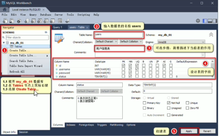

# Node.js

### 1.Node.js简介

1.什么是Node.js
Node.js是个基于Chrome V8引的JavaScript运行环境。

2.Node,js中的JavaScript运行环境


注意：
1.浏览器是JavaScript的前端运行环境。
2.Node.js是JavaScript的后端运行环境，
3.Node.js中无法调用DOM和BOM等浏览器内置API。

3.Node.js可以做什么
Node.js作为一个JavaScript的运行环境，仅仅提供了基础的功能和APl。然而，基于Node.js提供的这些基础能，很多强大的工具和框架如雨后春笋，层出不穷，所以学会了Node.js,可以让前端程序员胜任更多的工作和岗位：

①基于Express框架(http://www.expressjs.com.cn),可以快速构建Web应用
②基于Electron框架(https://electronjs.org/),可以构跨平台的桌面应用
③基于restify框架(http://restify..com),可以快速构建API接口项目
④读写和操作数据库、创建实用的命令行工具铺助前端开发、etc.

总之：Node.js是大前端时代的“大宝剑”，有了Node.js这个超级buff的加持，前端程序员的行业竞争力会越来越强！

Node.js的学习路径：
JavaScript基础语法+Node.js内置API模块(fs、path、http等)+第三方API模块(express、.mysql等)

### 2.Node.js环境安装

安装包可以从Node.js的官网首页直接下载，进入到Node.js的官网首页(https://nodejs.org/en/),点击绿色的按钮，下载所需的版本后，双击直接安装即可。

1.区分LTS版本和Current版本的不同
①LTS为长期稳定版，对于追求稳定性的企业级项目来说，推荐安装LTS版本的Node.js。.
②Current为新特性尝鲜版，对热衷于尝试新特性的用户来说，推荐安装Current版本的Node.js。但是，Current版本中可能存在隐的Bug或支全性漏问，因此不推荐在企业级项目中使用Current版本的Node,js。

安装过程中一路Next就可以

2.查看已安装的Node.js的版本号

打开终端，在终端输入命令node -v 后，按下回车键，即可查看已安装的Node.js的版本号。

```
node -v
```

Vindows系统快速打开终端的方式：
使用快挂键(Windows徽标键+R)打开运行面板，输入cmd后直接回车，即可打开终端。

3.什么是终端

终端（英文：Terminal))是专门为开发人员设计的，用于实现人机交互的一种方式。作为一名合格的程序员，我们有必要识记一些常用的终端命令，来辅助我们更好的操作与使用计算机。

### 3.初识Node.js

1.在Node.js环境中执行JavaScript代码
①打开終端
②输入node要执行的js文件的路径

```
cd 文件路径
```

cd 跳转到指定目录

```
node 1.js
```

node 需要执行的js文件

也可以在文件夹中直接右键终端运行或者在文件地址中直接输入cmd

2.终端中的快捷键
在Windows的powershell或cmd终端中，我们可以通过如下快捷键，来提高终端的操作效率：

①使用↑键，可以快速定位到上一次执行的命令
②使用tab键，能够快速补全路径
③使用esc键，能够快速清空当前已输入的命令
④输入cls命令，可以清空终端

### 4. fs文件系统模块

1.什么是fs文件系统模块

fs模块是Nod.js官方提供的、用来操作文件的模块。它提供了一系列的方法和属性，用来满足用户对文件的操作需求。

例如：
1.fs.readFile()方法，用来读取指定文件中的内容
2.fs.writeFile()方法，用来向指定的文件中写入内容
如果要在JavaScript代码中，使用fs模块来操作文件，则需要使用如下的方式先导入它：

```
1 const fs = require('fs')
```

2.读取指定文件中的内容

1.fs.readFile()的语法格式
使用fs.readFile()方法，可以读取指定文件中的内容，语法格式如下：

```
1 fs.readFile(path[,options].callback)
```

参数解读：
·参数1：必选参数，path 字符串，表示文件的路径。
·参数2：可选参数，options 表示以什么编码格式来读取文件。
·参数3：必选参数，callback 文件读取完成后，通过回调函数拿到读取的结果。

2.fs.readFile()的示例代码
以utf8的编码格式，读取指定文件的内容，并特打印err和dataStr的值：

```js
 const fs = require('fs')
 fs.readFile('./files/11.txt','utf8',function(err,datastr){
 	console.log(err)
	console.log('-----')
 	console.log(datastr)
 })
```

err, dataStr拿到读取失败和成功的结果 

如果读取成功err的值为null
如果读取失败err的值为错误对象，dataStr的值为undefined

3.判断文件是否读取成功  
可以判断err对象是否为null,从而知晓文件读取的结果：

```js
const fs = require('fs')
fs.readFile('./files/1.txt','utf8',function(err,result){
if (err){
return console,.log('文件读取失数！'+err.message)
}
console.log("文件读取成功，内容是：·+result)
    })
```

3.向指定的文件中写入内容

1.fs.writeFile()的语法格式

使用fs.writeFile()方法，可以向指定的文件中写入内容，语法格式如下：

```
fs.writeFile(file,data[,options],callback)
```

●参数1：必选参数，file需要指定一个文件路径的字符串，表示文件的存放路径。
●参数2：必选参数，data表示要写入的内容。
●参数3：可选参数，options表示以什么格式写入文件内容，默认值是u8。
●参数4：必选参数，callback文件写入完成后的回调函数。

2.fs.writeFile()的示例代码
向指定的文件路径中，写入文件内容：

```
 const fs = require('fs')
 fs.writeFile('./files/2.txt','Hello Node.js!',function(err){
 console.log(err)
})
```

如果文件写入成功arr=null
如果文件写入失败，则 err 的值等于一个 错误对象

fs.writeFile()方法只能用来创建文件，不能用来创建路径

重复调用fs.writeFile()写入同一个文件，新写入的内容会覆盖之前的l旧内容

3.判断文件是否写入成功

```
const fs = require('fs')
fs.writeFile('F:/files/2.txt','Hello Node.js!',function(err){
if (err){
return console.log('文件写入失败：'+err.message)
console.1og('文件写入成功：")
})
```

4.fs模块-路径动态拼接的问题
在使用fs模块操作文件时，如果提供的操作路径是以./或../开头的相对路径时，很容易出现路径动态拼接错误的问题，

原因：代码在运行的时候，会以执行node**命令时所处的目录**，动态拼接出被操作文件的完整路径。


出现路径拼接错误的问题，是因为提供了 ./ 或 ../ 开头的相对路径
如果要解决这个问题，可以直接提供一个完整的文件存放路径就行

E:\文档\HBuilderX\案例\node.js\day1\files

注意js里面一个 \ 代表转义 需要改成 \\\

缺点：移植性非常差、不利于维护

```
//不要使用，/或，//这样的相对路径
fs.readFile('./files/1.txt','utf8',function(err,dataStr){
if(err)return console.log('读取文件失败！'+err.message)
console.log(dataStr)
})
//__dirname表示当前文件所处的目录
fs.readFile(dirname '/files/1.txt','utf8',function(err,datastr){
if(err)return console.log('读取文件失败！'+crr.message)
console.log(dataStr)
})
```

__dirname表示当前文件所处的目录

5.总结

### 5.什么是path路径模块
pth模快是Node.js官方提供的、用来处理路径的模块。它提供了一系列的方法和属性，用来满足用户对路径的处理需求。

path.join()方法，用来将多个路径片段拼接成一个完整的路径字符由
path.basename()方法，用来从路径字符串中，将文件名解析出来

如果要在JavaScript代码中，使用path模块来处理路径，则需要使用如下的方式先导入它：

```
 const path = require('path')
```

1.路径拼接
1.path.join()的语法格式
使用path.join()方法，可以把多个路径片段拼接为完整的路径字符串，语法格式如下：

```
path.join([...paths])
```

参数解读：
●...paths <string>路径片段的序列 参数可以很多
●返回值：<string>  拼接好的路径字符串

2.path.join()的代码示例
使用path.join()方法，可以把多个路径片段拼接为完整的路径字符串：

```
const pathstr = path.join('/a'.'/b/c','../''./d','e')
console.log(pathstr)//输出\a\b\d\e
const pathstr2 = path.join(__dirname,'./files/1.txt')
console.log(pathstr2)/翰出当前文件所处目录\files\1.txt
```

../ 有抵消路径这个功能

注意：今后凡是涉及到路径拼接的操作，都腰使用path.join()方法进行处理，不要直接使用+进行字符中的拼接。

3.获取路径中的文件名
1.path.basename()的语法格式

使用path.basename()方法，可以获取路径中的最后一部分，经常通过这个方法获取路径中的文件名，语法格式如下：

```
 path.basename(path[,ext])
```

参数解读：
●path<string>必选参数，表示一个路径的字符串
●ext<string>可选参数，表示文件扩展名
●返回：<string>表示路径中的最后一部分

2.path.basename()的代码示例
使用path.basename()方法，可以从一个文件路径中，获取到文件的名称部分：

```js
 const fpath='/a/b/c/index.html'//文件的存放路径
 var fullName = path.basename(fpath)
 console.log(fullName)//输出index.html
 var namewithoutExt = path.basename(fpath.'.html')
 console.log(namewithoutExt)//输出index
```

4.获取路径中的文件扩展名
1.path.extname()的语法格式
使用path.extname()方法，可以获取路径中的扩展名部分，语法格式如下：

```
path.extname(path)
```

参数解读：
·path<string>必选参数，表示一个路径的字符串
·返回：<string>返回得到的扩展名字符串

2.path.extname()的代码示例
使用path.extname()方法，可以获取路径中的扩展名部分：

```
const fpath='/a/b/c/index.html'//路径字符串
const fext = path.extname(fpath)
console.log(fext)//输出，html
```

### 6.http模块

1.什么是http模块
回顾：什么是客户端、什么是服务器？
在网络节点中，负责消费资源的电脑，叫做客户端：负责对外提供网络资源的电脑，叫做服务器。
http模块是Node.js官方提供的、用来创建web服务器的模块，通过http模块提供的http.createServer()方法，就能方便的把一台普通的电脑，变成一台Web服务器，从而对外提供Web资源服务。
如果要希望使用http模块创建Web服务器，则需要先导入它：

```
 const http = require('http')
```

2.进一步理解http模块的作用
服务器和普通电脑的区别在于，服务器上安装了web服务器软件，例如：IlS、Apache等。过安装这些服务器软件，就能把一台普通的电脑变成一台web服务器。

在Node.js中，我们不需要使用IlS、Apache等这些第三方web服务器软件.因为我们可以基于Node.js提供的http模块，通过几行简单的代码，就能轻松的手写一个服务器软件，从而对外提供web服务.

3.服务器相关的概念

IP地址就是互联网上每台计算机的唯一地址，因此IP地址具有唯一性。如果把“个人电脑比作“一台电话”，那么IP地址“就相当于“电话号码“，只有在知道对方IP地址的前提下，才能与对应的电脑之间进行数据通信。

IP地址的格式：通常用“点分十进制"表示成(a.b.c.d)的形式，其中，a,b,c,d都是0~255之间的十进制整数。例如：用点分十进表示的P地址(192.168.1.1)

注意：
①互联网中每台Web服务器，都有自己的IP地址，如：大家可以在Windows的终端中运行ping www.baidu.com命令，即可查看到百度服务器的IP地址。

②在开发期间，自己的电脑既是一台服务器，也是一个客户端，为了方使测试，可以在自己的浏览器中输入127.0.0.1这个IP地址，就能把自己的电脑当做一台服务器进行访问了，

尽管IP地址能够唯一地标记网络上的计算机，但地址是一长串数字，不直观，而且不使于记忆，于是人们又发明了另一套**字符型**的地址方案，即所谓的域名(Domain Name)地t址。

IP地址和域名是一对应的关系，这份对应关系存放在一种叫做域名服务器(DNS,Domain name server)的电脑中。使用者只需通过好记的域名访问对应的服务器即可，对应的转换工作由域名服务器实现。因此，域名服务器就是提供IP地址和域名之间的转换服务的服务器。

注意：
①单纯使用IP地址，互联网中的电脑也能够正常工作，但是有了域名的加特，能让互联网的世界变得更加方便
②在开发测试期间，127.0.0.1 对应的域名足localhost,它们都代表我们自己的这台电脑，在使用效果上没有任何区别，

端口号
计算机中的端口号，就好像是现实生活中的门牌号一样。通过门牌号，外卖小哥可以在整栋大楼众多的房间中，准确把外卖送到你的手中。

同样的道理，在一台电脑中，可以运行成有上千个web服务。每个web服务都对应一个唯一的口号。客户端发送过来的网络请求，通过端口号，可以被准确地交给对应的web服务进行处理。

注意：
①每个端口号不能同时被多个web服务占用.
②在实际应用中，URL中的80端口可以被省路。

4.创建最基本的web服务器
1.创建web服务器的基本步骤
①导入http模块
②创建web服务器实例
③为服务器实例绑定request事件，监听客户端的请求
④启动服务器

4.导入http模块

步骤1-导入http模块
如果希望在自己的电脑上创建一个web服务器，从而对外提供web服务，则需要导入http模块：

```
const http = require('http')
```

步骤2-创建web服务器实例
调用http.createServer()方法，即可快速创建一个web服务器实例：

```
 const server = http.createServer()
```

步骤3-为服务器实例绑定request事件
为服务器实例绑定request事件，即可监听客户端发送过来的网络请求：

```JS
//使用服务器实例的，on()小方法，为服务器绑定一个request事件
server.on('request',(req,res)=>{
//只要有客户端来请求我们自己的服务器，就会继发request事件，从调用这个事件处理函数
console.log('Someone visit our web server.')
})
```

步骤4-启动服务器
调用服务器实例的.listen()方法，即可启动当前的web服务器实例：

```js
//调用server,1 isten(端口号，cb回调)方法，即可启动web服务器
server.listen(80,()=>{
console.log('http server running at http://127.0.0.1')
})
```

5.req请求对象
只要服务器接收到了客户端的请求，就会调用通过server.on()为服务器绑定的request事件处理函数，

如果想在事件处理函数中，访问与客户端相关的数据或属性，可以使用如下的方式：

```js
server.on('request',(req)=>
//req是请求对像，它包含了与客户端相关的数据和属性，例收如：
//req.url是客户端请求的URL地址
const url= req.url
//req.method是客户端的method请求类型
const method=req.method
const str =Your request url is ${req.url},and request method is ${req.method}
console.log(str)
})
```

6.res响应对像
在服务器的request事件处理函数中，如果想访问与服务器相关的数据或属性，可以使用如下的方式：

```js
server.on('request',(req,res)=
//res是响应对家，它包含了与服务器相关的数据和属性，例如：要发送到客户端的字符串
const str =Your request url is s{req.url},and request method is s{req.method)
//res.end()方法的作用：
//向客户端发送指定的内容，并结束这次清求的处理过程
res.end(str)
})
```

7.解决中文乱码问题
当调用res.end()方法，向客户端发送中文内容的时候，会出现乱码问题，此时，需要手动设置内容的编码格式：

```js
server.on('request',(req,res)=>{ 
//发送的内容包含中文
const str='您请求的url地址是$(req.url},请求的method类型是${req.method}
//为了防止中文显示乱码的问题，需要设置响应头Content-Type的值为text/html;charset=utf-8
res.setHeader('Content-Type','text/html;charset=utf-8')
//把包含中文的内容，响应给客户端
res.end(str)
})
```

8.根据不同的url响应不同的html内容
1.核心实现步骤
①获取请求的u地址
②设置默认响应内容为404 Not found
③判断用户请求的是否为/或index.html首页
④判断用户请求的是否为/about.html关于页面
⑤设置Content-Type响应头，防止中文乱码
⑥使用res.end()把内容响应给客户端

2.动态响应内容

```js
server.on('request',function(req,res){
const url = req.url
//1.获取清求的ur1地址
let content='<h1>404 Not found!</h1>'//2.设置默认的内容为404 Not found
if (url ==='/'||url =='/index.html'){
content='<h1>首页</h1>'
//3.用户请求的是首页
}else if (url ==='/about.html'){
content='<h1>关于页面</h1>' //4.用户请求的是关于页面
}
res.setHeader('Content.-Type','text/html;charset:=utf-8')//5.设置Content-Type响应头，防止中文乱码
res.end(content)
//16.把内容发送给客户端
})
```

3.实现clock时钟的web服务器

把文件的实际存放路径，作为每个资源的请求url地址，****

实现步骤
①导入需要的模块
②创建基本的web服务器
③将资源的请求url地址映射为文件的存放路径
④读取文件内容并响应给客户端
⑤优化资源的请求路径

步骤1·导入需要的模块

```js
1//1,1导入http模块
2 const http = require('http')
3//1.2导入fs文件系统模块
4 const fs = require('fs')
5//1.3导入path路径处理模块
6 const path = require('path')
```

步骤2-创建基本的web服务器

```js
1//2.1创键web服务器
2 const server = http.createServer()
3
4//2.2监听web服务器的request事件
5 server.on('request',function(req,res){})
6
7//2.3启动web服务器
8 server.listen(80,function(){
9 console.log('server listen at http://127.0.0.1')
10})
```

步骤3-将资源的请求u地址映射为文件的存放路径

```js
//3.1获取到客户端请求的ur1地址
const url =  req.url
//3.2把请求的u1地址，映射为本地文件的存放路径
const fpath = path.join(_dirname,url)
```

步骤4-读取文件的内容并响应给客户端

```js
//4,1根据“映射”过来的路径
fs.readFile(path,'utf8',(err,dataStr)=>{ 
//4,2读取文件失败后，向客户端响应回定的”错民消息”
if(err)return res.end('404 Not fount.')
//4.3读取文件成功后，将“读取成功的内客”响应给客户端
res.end(datastr)
})
```

步骤5-优化资源的请求路径

```js
//***将3.2的实现方式，改为如下代码：
//5.1预定义空白的文件存放路径
let fpath=''
if(url=='/'){
//5.2如果请求的路径是否为/，则手动指定文件的存放路径
fpath = path.join(dirname,'./clock/index.html'
}else{ 
//5.3如果请求的路径不为/，则动态拼接文件的存放路径
fpath = path.join(dirname,'./clock',url)
}
```

### 7.模块化

1.什么是模块化
模块化是指解决一个复杂问题时，自顶向下逐层把系统划份成若干模块的过程。对于整个系统来说，模块是可组合、分解和更换的单元，

1.现实生活中的模块化


2.编程领域中的模块化
编程领域中的模块化，就是遵守固定的规则，把一个大文件拆成独立并互相依赖的多个小模块。

把代码进行模块化拆分的好处：

1. 提高了代码的复用性
2. 提高了代码的可维护性
3. 可以实现按需加载

3.模块化规范
模块化规范就是对代码进行模块化的拆分与组合时，需要遵守的那些规则，
例如：
1.使用什么样的语法格式来引用模块
2.在模块中使用什么样的语法格式向外暴露成员

模块化规范的好处：大家都遵守同样的模块化规范写代码，降低了沟通的成本，极大方便了各个模块之间的相互调用，利人利已。

4.Node.js中模块的分类
1.Node.js中根据模块来源的不同，将模块分为了3大类。分别是：

1. 内置模块（内置模块是由Node.js官方提供的，例如fs、path、http等）
2. 自定义模块（用户创建的每个.js文件，都是自定义模块）
3. 第三方模块（由第三方开发出来的模块，并非官方提供的内置模块，也不是用户创建的自定义模块，使用前需要先下载）

2.加载模块
使用强大的require()方法，可以加载需要的内置模块、用户自定义模块、第三方模进行使用。列如：

```js
//1,加截内置的fs模块
const fs = require('fs')
//2.加截用户的自定义模块不加后缀名也可以
const custom = require('./custom.js')
//3.加载第三方模块（关于第三方模块的下载和使用，会在后面的课程中进行专门的讲解）
const moment = require('moment')
```

注意：使用require()方法加载其它模块时，会执行被加载模块中的代码。

3.Node.js中的模块作用域
1.什么是模块作用域
和函数作用域类似，在自定义榄块中定义的变量、方法等成员，只能在当前模块内被访问，这种模块级别的问限制，叫做模快作用域。


2.模块作用域的好处
防止了全局变量污染的问题

4.向外共享模块作用域中的成员
1.module对象
在每个js自定义模块中都有，一个module对橡，它里面存储了和当前模块有关的信息，打印如下：

2.module.exports对象

在自定义模块中，可以使用module.exports对象，将模块内的成员共享出去，供外界使用。

外界用require()方法导入自定义模块时，得到的就是module.exports所指向的对象。

```
// 在一个自定义模块中，默认情况下， module.exports = {}
const age = 20
// 向 module.exports 对象上挂载 username 属性
module.exports.username='zs'
// 向 module.exports 对象上挂载 sayHello 方法
module.exports.sayhello=function(){
	console.log('hello')
}
module.exports.age=age
```

3.共享成员时的注意点
使用require()方法导入模块时，导入的结果，永远以module.exports指向的对象为准。


4.向外共享模块作用域中的成员
1.exports对象

由于module.exports单词写起来比较复杂，为了简化向外共享成员的代码，Node提供了exports对象。默认情况下，exports和module.exports指向同一个对象。最终共享的结果，还是以module.exports指向的对象为准，


最终，向外共享的结果，永远都是 module.exports 所指向的对象

2.exports和nodule.exports的使用误区
时刻谨记，require()模块时，得到的永远是module.exports指向的对象：


注意：为了防止混乱，建议大家不要在同一个模块中同时使用exports和module.exports

5.Node.js中的模块化规范
Node.js遵循了CommonJS模块化规范，CommonJS规定了模块的特性和各模块之问如何相互依赖，

CommonJS规定：
①每个模块内部，module变显代表当前模块，
②module变量是一个对象，它的exports属性（即module.exports)是对外的接口.
③加载某个模块，其实是加载该模块的module.exports属性。require()方法用于加载模块。

### 8.npm和包

1.npm和包

1.Node.js中的第三方模块又叫做包。
就像电脑和计算机指的是相同的东西，第三方模块和包指的是同一个概念，只不过叫法不同。

2.包的来源
不同于Node.js中的内置模块与自定义模块，包是由第三方个人或队开发出来的，免费供所有人使用。

注意：Node.js中的包都是免费目开源的，不需要付费即可免费下载使用.

3.为什么需要包
由于Node.js的内置模块仅提供了一些底层的API,导致在基于内置模块进行项目开发的时，效率很低
**包是基于内置模块封装出来的**，提供了更高级、更方使的API,**极大的提高了开发效率。**

包和内置模块之间的关系，类似于jQuery和浏览器内置API之间的关系。

4.从哪里下载包

国外有一家IT公司，叫做npm,Inc.这家公可旗下有一个非常著名的网站(https://www.npmjs.com/),它是全球最大的包共享平台，你可以从这个网站上搜索到任何你需要的包，只要你有足的耐心！

到目前未知，全球约1100多万的开发人员，通过这个包共享平台，开发并共享了超过120多万个包供我们使用。

npm,lnc.公司提供了一个地址为http://registry.npmjs.org的服务器来对外共享所有的包，我们可以从这个服务器上下载自己所需要的包

5.如何下载包

npm,Inc.公司提供了一个包管理工具，我们可以使用这个包管理工具，从http://registry.npmjs.org服务器把需要的包下载到本地使用。

这个包管理工具的名字叫做Node Package Manager(简称npm包首理工具)，这个包管理工具随着Node.js的安装包一起被安装到了用户的电脑上。

大家可以在终端中执行npm -v命令，来查看自己电脑上所安装的npm包首理工具的版本号：

2.npm初体验
1.格式化时间的传统做法


1. 创建格式化时间的自定义模块

2. 定义格式化时间的方法
3. 创建补零函数
4. 从自定义模块中导出格式化时间的函数
5. 导入格式化时间的自定义模块
6. 调用格式化时间的函数

2.格式化时间的高级做法

①使用npm包管理工具，在项目中安装格式化时间的包moment
②使用require(）导入格式化时间的包
③参考moment的官方API文档对时间进行格式化

```js
//1,导入moment包
const moment = require('moment')
//2.参考moment官方API文档，调用对应的方法，对时间进行格式化
//2.1调用moment()方法，得到当的时间
//2.2针对当前的时间，调用format()方法，按照指的格式进行时间的格式化
const dt =moment().format('YYYY-MM-DD HH:mm:ss')
console.log(dt)//输出2020-01-1217：23：48
```

3.在项目中安装包的命令
如果想在项目中安装指定名称的包，需要运行如下的命令：

```
npm install 包的完整名称
```

上述的装包命令，可以简写成如下格式：

```
npm i 包的完整名称
```

注意导入的名称就是安装包时候的名称

具体教程详见[瞬间.js |文档 (momentjs.com)](https://momentjs.com/docs/)

4.初次装包后多了哪些文件
初次装包完成后，在项目文件夹下多一个叫做node_modules的文件夹和package-lock.json的配置文件。

其中：
node_modules**文件夹用来存放所有已安装到项目中的包**。require()导入第三方包时，就是从这个目录中查找并加载包。
package-lock.json配置文件用来**记录node_modules目录下的每一个包的下载信息**，例如包的名字、版本号、下载地址等。

注意：程序员不要手动修改node_modules或package-lock.json文件中的任何代码，npm包管理工具会自动维护它们。

5.安装指定版本的包

默认情况下，使用npm install命令安装包的时候，会自动安装最新版本的包。如果需要安装指定版本的包，可以在包名之后，通过@符号指定具体的版本，例如：

```
npm i moment@2.22.2
```

6.包的语义化版本规范
包的版本号是以“点分十进制”形式进行定义的，总共有三位数字，例如2.24.0

其中每一位数字所代表的的含义如下：
第1位数字：大版本
第2位数字：功能版本
第3位数字：Bug修版本

版本号提升的规则：只要前面的版本号增长了，则后面的版本号归零。


3.包管理配置文件

npm规定，在项目根目录中，必须提供一个叫做packāge.json的包管理配置文件。用来记录与项目有关的一些配置信息。例如：

●项目的名称、版本号、描述等
●项目中都用到了哪些包
●那些包只在开发期间会用到
●那些包在开发和部署时都需要用到

1.多人协作的问题

整个项目的体积是30.4M
第三方包的体积是28.8M
项目源代码的体积1.6M
遇到的问题：第三方包的体积过大，不方使团队成员之间共亨项目源代码。

解决方案：共享时删除node_modules

2.如何记录项目中安装了那些包

在项目根目录中，创建一个叫做package.json的配置文件，即可用来记录项目中安装了哪些包。从而方使剔除node_modules目录之后，在团队成员之间共享项目的源代码。

注意：今后在项目开发中，定要把node_modules文件夹，添加到.gitignore忽略文件中。

3.快速创建package.json
npm包管理工具提供了一个快捷命令，可以在执行命令时所处的目录中，快速创建package.json这个包管理配置文件：

```
//作用：在执行命令所处的日录中，快速新建package.json文件
npm init -y
```

注意：
①上述命令只能在英文的目录下成功运行！所以，项目文件夹的名称一定要使用英文命名，不要使用中文，不能出现空格。
②运行npm install命令安装包的时候，npm包管理工具会自动把包的名称和版本号，记录到package.json中。

一般项目在刚开始的时候就创建package.json文件

4.dependencies节点


package.json文件中，有一个dependencies节点，专门用来记录您使用npm install
命令安装了那些包。

5.一次性安装所有的包
当我们拿到一个剔除了node_modules的项目之后，需要先把所有的包下载到项目中，才能将项目运行起来。否则会报类以于下面的错误：

```
//由于项目运行依赖于moment这个包，如果没有提前安装好这个包，就会报如下的错误：
Error:Cannot find module 'moment'
```

可以运行npm install命令（成npm i)一次性安装所有的依赖包：

```
//执行npm install命令时，npm包管理工具会先读取package.json中的dependencies节点，
//读取到记录的所有依赖包名称和版本号之后，npm包管理工具会把这些包一次性下载到项目中
npm install
```

6.卸载包
可以运行npm uninstall命令，来卸指定的包：

```
//使用npm uninstall 具体的包名来卸载包
npm uninstall moment
```

注意：npm uninstall命令执行成功后，会把卸载的包，自动从package.json的dependencies中移除掉。

7.devDependencies节点
如果某些包只在项目开发阶段会用到，在项目上线之后不会用到，则建议把这些包记录到devDependencies节点中。

与之对应的如果某些包在开发和项目上线之后都需要用到，则建议把这些包记录到dependencies节点中

您可以使用如下的命令，将包记录到devDependencies节点中：

```
//安装指定的包，并记录到devDependencies节点中
npm i 包名 -D
//注意：上述命令是简写形式，等价于下面完整的写法：
npm install 包名 --save-dev
```

包名 和  save-dev参数顺序不重要

4.解决下包速度慢的问题
1.为什么下包速度慢

在使用npm下包的时候，默认从国外的https://registry.npmjs,org/服务器进行下载，此时，网络数据的传输需要经过浸长的海底光缆，因此下包速度会很慢。

2.淘宝NPM镜像服务器

淘宝在国内搭建了一个服务器，专门把国外官方服务器上的包同步到国内的服务器，然后在国内提供下包的服务。从而极大的提高了下包的速度。

扩展：
镜像(Mirroring)是一种文件存储形式，一个磁盘上的数据在另一个磁盘上存在一个完全相同的副本即为镜像。

3.切换npm的下包镜像源

下包的镜像源，指的就是下包的服务器地址。

```
#查看当前的下包镜像源
npm config get registry
#将包的镜像源切换为淘宝镜像源
npm config set registry=https://registry.npm.taobao.org/
#检查镜像源是否下载成功
npm config get registry
```

4.nrm

为了更方使的切换下包的镜像源，我们可以安装**nrm**这个小工具，利用nrm提供的终端命令，可以快速查看和切换下包的镜像源。

```
#通过npm包管理器，将nrm安装为全局可用的工具
npm i nrm -g
#查看所有可用的镜像源
nrm ls
#将下包的镜像源切换为taobao镜像
nrm use taobao
```

5.包的分类

使用npm包管理工具下我的包，共分为两大类，分别是：

1.项目包

那些被安装到项目的node_modules目录中的包，都是项目包。

项目包又分为两类，分别是：
·开发依赖包（被记录到devDependencies节点中的包，只在开发明间会用到）
·核心依赖包（被记录到dependencies节点中的包，在开发明间和项目上线之后都会用到）

```
npm i 包名 -D
#开发依赖包（会被记录到devDependencies节点下）
npm i 包名
#核心依赖包（会被记录到dependencies节点下)
```

2.全局包
在执行npm install命令时，如果提供了-g参数，则会把包安装为全局包

全局包会被安装到C:\Users\用户目录\AppData\Roaming\npm\node_modules目录下。

```
npm i 包名 -g
#全局安装指定的包
npm uninstall 包名 -g
#卸载全局安装包
```

注意：
①只有工具性质的包，才有全局安装的必要性。因为它们提供了好用的终端命令。
②判断某个包是否需要全局安装后才能使用，可以参者官方提供的使用说明即可。

3.i5ting_toc

i5ting_toc是一个可以把md文档转为html页面的小工具，使用步案如下：

```
#将i5ting_toc安装为全局包
npm install -g i5ting_toc
#调用i5ting_toc,轻松实现md转html的功能
i5ting_toc -f 要转换的md文件路径 -o
```

6.规范的包结构
在清楚了包的概念、以及如何下载和使用包之后，接下来，我们深入了解一下包的内部结构。
一个规范的包，它的组成结构，必须符合以下3点要求：
①包必须以单独的目录而存在
②包的顶级日录下要必须包含package.json这个包管理配置文件
③package.json中必须包含name,version,main这三个属性，分别代表包的名字、版本号、包的入口.

注意：以上3点要求是一个规范的包结构必须遵守的格式，关于更多的约束，可以参考网络

7.开发属于自己的包
1.需要实现的功能

1. 格式化日期
2. 转义HTML中的特殊字符
3. 还原HTML中的特殊字符

```js
//1.导入自己的包
const itheima = require('itehima-utils')
//----功能1：格式化日期-----
const dt = itheima.dateFormat(new Date())
//输出2020-01-2010：09：45
console.log(dt)
```

```js
//1.导入自己的包
const itheima require('itehima-utils')
//-----功能2：转义HTML中的特殊字符-----
const htmlStr='<h1 style="color:red;">你好！&copy;<span>小黄！</span><h1>'
const str = itheima.htmlEscape(htmlStr)
//&lt;h1 style=&quot;color:red;&quot;&gt;你好！&amp;copy:&lt;span&gt;小黄！&lt;/span&gt;&lt;/h1&gt:
console.log(str)
```

```js
//1.导入自己的包
const itheima = require('itehima-utils')
//------功能3：还原HTML中的特殊字符----
const rawHTML = itheima.htmlUnEscape(str)
//输出<h1 style="color:ed;">你好！&copy;<span>小黄！</span></h1>
console.log(rawHTML)
```

2.初始化包的基本结构

①新建itheima-tools文件夹，作为包的根目录
②在itheima-tools文件夹中，新建如下三个文件：
		package.json(包管理配置文件)
		index.js(包的入口文件)
		README.md(包的说明文档）

3.初始化package.json

```
"name":"itheima-tools",
"version":"1.0.0",
"main":"index.js",
"description":"提供了格式化时间，HTMLEscape的功能"，
"keywords":["itheima","dateFormat","escape"],
"license":"ISC"
```

main的作用require调用的时候如果有package.json文件就会去找main指向的文件

4.在index,js中定义格式化时间的方法

```js
//格式化时间的方法
function dateFormat(dateStr){
	const dt=new Date(dateStr)
	const y=padZero(dt.getFullYear())
	const m=padZero(dt.getMonth()+1)
	const d=padZero(dt.getDate())
	const hh=padZero(dt.getHours())
	const mm=padZero(dt.getMinutes())
	const ss=padZero(dt.getSeconds())
	
	// return 'YYYY-MM-DD HH:mm:ss'
	return `${y}-${m}-${d} ${hh}:${mm}:${ss}`
}
//1补零的方法
function padZero(n){
	return n>9 ? n:'0'+n
}
module.exports ={ 
daterormat
}
```

5.在index.js中定义转义HTML的方法

```js
function htmlEscape(htmlstr){
	return htmlstr.replace(/<|>|"|&/g,(match)=>{
		switch(match){
			case'<':
				return'&lt;'
			case'>':
				return'&gt;'
			case '"':
				return '&quot;'
			case '&':
				return '&amp;'
		}
	})
}
```

6.在index,js中定义还原HTML的方法

```
function htmlUnEscape(str) {
  return str.replace(/&lt;|&gt;|&quot;|&amp;/g, match => {
    switch (match) {
      case '&lt;':
        return '<'
      case '&gt;':
        return '>'
      case '&quot;':
        return '"'
      case '&amp;':
        return '&'
    }
  })
}
```

测试

```
const itheima=require('./itheima-tools')
//格式化时间
// const dtstr=itheima.dateFormat(new Date())
// console.log(dtstr)

const htmlStr = '<h1 title="abc">这是h1标签<span>123&nbsp;</span></h1>'
const str=itheima.htmlEscape(htmlStr)
console.log(str)

const str2 = itheima.htmlUnEscape(str)
console.log(str2)
```

7.将不同的功能进行模块化拆分

①将格式化时间的功能，拆分到src->dateFormat.js中
②将处理HTML字符串的功能，拆分到src->htmlEscape.js中
③在index.js中，导入两个模块，得到需要向外共享的方法
④在index.js中，使用module.exports把对应的方法共享出去

8.编写包的说明文档

包根目录中的README.md文件，是包的使用说明文档。通过它，我们可以事先把包的使用说明，以markdown的格式写出来，方使用户参考。

README文件中具体写什么内容，没有强制性的要求；只要能够清晰浙地把包的作用、用法、注意事项等描述清楚即可

我们所创建的这个包的README.md文档中，会包含以下6项内容：
安装方式、导入方式、格式化时间、转义HTML中的特殊字符、还原HTML中的特殊字符、开源协议

9.发布包
1.注册npm账号

①访问https://www.npmjs.com/网站，点击sign up按扭，进入注册用户界面
②填写账号相关的信息：Full Name、Public Email、.Username、Password
③点击Create an Account按钮，注册账号登录邮箱，点击验证链接，进行账号的验证

2.登录npm账号
npm账号注册完成后，可以在终端中执行npm login命令，依次输入用户名、密码、邮箱后，即可登录成功。

注意：在运行npm login命冷之前，必须先把下包的服务器地址切换为npm的官方
服务器。否则会导致发布包失败！


成功

10.发布包
1.把包发布到npm上
将终端切换到包的根目录之后，运行npm publish命令，即可将包发布到npm上（注意：包名不能街同）。


2.删除已发布的包

运行npm unpublish 包名 -force 命令，即可从npm删除已发布的包。


1. npm unpublish命令只能除72小时以内发布的包
2. npm unpublish删除的包，在24小时内不允许重复发布
3. 
   发布包的时候要慎重，尽量不要往npm上发布没有意义的包！
   

### 9.模块的加载机制

1.优先从缓存中加载
模块在第一次幼加载后会被缓存.这也意味看多次调用require()不会导致模块的代码被执行多次。

注意：不论是内置模块、用户自定义模块、还是第三方模块，它们都会优先从缓存中加载，从而提高模块的加载效率

2.内置模块的加载机制
内置模块是由Node.js官方提供的模块，内置模块的加载优先级最高。

例如，require('fs')始终返回内置的fs模，即使在node_modules目录下有名字相同的包也叫做fs.

3.自定义模块的加载机制
使用require()加载自定义模块时，必须指定以./或../开头的路径标识符。在加我自定义模块时，如果设有指定./或../这样的路径标识符，则node会把它当作内置模块或第三方模块进行加载

同时，在使用require()导入自定义模块时，如果省略了文件的扩展名，则Node.js会按顺序分别尝试加截以下的文件：

1. 按照确切的文件名进行加载
2. 补全js扩展名进行加载
3. 补全json扩展名进行加载
4. 补全.node扩展名进行加载
5. 加载失败，终端报错

4.第三方模块的加载机制
如果传递给require(）的模块标识符不是一个内置模块，也设有以 ./或../开头，则Node.js会从当前模块的父目录开始，尝试从node_modules文件夹中加载第三方模块。

**如果没有找到对应的第三方模块，则移动到再上一层父目录中，进行加载。直到文件系统的根目录，**

例如，假设在'C:\Users\itheima\project\foo.js'文件里调用了require('tools'),则Node.js会按以下顺序查找：

1. C:\Users\itheima\\project\\**node_modules**\tools
2. C:\Users\itheima\\**node_modules**\tools
3. C:\Users\\**node_modules**\tools
4. C:\\**node_modules**\tools
5. 如果没有直接报错

5.目录作为模块
当把目录作为模块标识符，传递给require()进行加载的时候，有三种加截方式：

①在被加载的目录下查找一个叫做package.json的文件，并寻找main属性，作为require加载的入口
②如果目录里没有package.json文件，或者main入口不存在或无法解析，则Node.js将会试图加截目录下的index.js文件.
③如果以上两步都失败了，则Node.js会在终端打印错误消息，报告模块的缺失：Error:Cannot find module'Xx

### 10.express

1.Express简介

1.什么是Express
官方给出的概念：Express是基于Node.js平台，快速、开放、极简的Web开发框架。

通俗的理解：Express的作用和Node,js内的http模块类似，是专门用来创建Web服务器的.

Express的本质：就是一个npm上的第三方包，提供了快速创健Web服务器的使捷方法。

Express的中文官网：https://www.expressjs.com.cn/

2.进一步理解Express
思考：不使用Express能否创建Web服务器？
答家：能，使用Node,js提供的原生http模块即可。

思考：既生喻何生亮（有了http内置模块，为什么还有用Express)?
答案：http内置模块用起来很复杂，开发效率低；Express是基于内置的http模块进一步封装出来的，能够极大的提高开发效率。

思考：http内置模块与Express是什么关系？
答案：类似于浏览器中Web API和jQuery的关系，后者是基于前者进一步封装出来的。

3.Express能做什么
对于前端程序员来说，最常见的两种服务器，分别是：
●Web网站服务器：专门对外提供Web网页资源的服务器。
●AP接口服务器：专门对外提供API接口的服务器。

使用Express,我们可以方便、快速的创建Web网站的服务器或API接口的服务器。


2.Express的基本使用

1.安装
在项目所处的目录中，运行如下的终端命令，即可将express安装到项目中使用：

```
npm i express@4.17.1
```

2.创建基本的Web服务器

```js
//1.导入express
const express = require('express')
//12.创健web服务器
const app = express()
//3.调用app.1 isten(端口号，启动成功后的回调函数)，启动服务器
app.listen(80,()=>(
console.log('express server running at http://127.0.0.1')
})
```

3.监听GET请求
通过app.get()方法，可以监听客户端的GfT清求，具体的语法格式如下：

```
//参数1：客户端请求的URL地址
//参数2：请求对应的处理函数
//req:请求对像（包含了与请求相关的属性与方法）
//res:响应对像（包含了与响应相关的属性与方法）
app.get('请求URL',function(req,res){/*处理函数*/})
```

4.监听POST请求
通过app.post()方法，可以监听客户端的POST请求，具体的语法格式如下：

```
//参数1：客户端请求的URL地址
//参数2：请求对应的处理函数
//req:请求对像（包含了与请求相关的属性与方法）
//res:响应对像（包含了与响应相关的属性与方法）
app.post('请求URl,function(req,res){/*处理函数*/})
```

5.把内容响应给客户端
通过res.send()方法，可以把处理好的内容，发送给客户端：

```
app.get('/user',(req,res)=>
//向客户端发送JSON对象
res.send({name:'zs',age:20,gender:'男'}
})
app.post('/user',(req,res)=>
//1向客户端发送文本内容
res.send('请求成功')
})
```

6.获取URL中携带的查询参数
通过req.query()对象，可以问到客户端通过查询字符串的形式，发送到服务器的参数：

```
app.get('/',(req,res)=>
//req.query默认是一个空对像
//客户端使用？name=zs&age=20这种查询字符串形式，发送到服务器的参数可以通过req.query对家访问到，例如：
//req.query.name
//req.query.age
console.log(req.query)
```

7.获取URL中的动态参数
通过req.params对象，可以问到URL中，通过：匹配到的动态参数：

```
//URL地址中，可以通过：参数名的形式，配动态参数值
//id随便改只不过属性名会改变也可以有多个动态参数
app.get('/user/:id',(req,res)=>
//reg.params默认是一个空对像
//里面存放着通过：动态匹配到的参数值
console.log(req.params)
})
```

3.托管静态资源

1.express.static()

express提供了一个非常好用的函数，叫做express.static()通过它，我们可以非常方使地创建一个静态资源服务器，
例如，通过如下代码就可以将public目录下的图片、CSS文件、JavaScript文件对外开放访问了：

```
app.use(express.static('public'))
```

现在，你就可以访问public目录中的所有文件了：
http://localhost:3000/images/bg.jpg
http://localhost:3000/css/style.css
http://localhost:3000/js/login.js

注意：Express在指定的静态目录中查找文件，并对外提供资源的方问路径。因此，存放静态文件的目录名不会出现在URL中。

2.托管多个静态资源目录
如果要托首多个静态资源目录，请多次调用express.static()函数：

```
app.use(express.static('public'))
app.use(express.static('files'))
```

访方问静态资源文件时，express.static()函数会根据目录的添加顺序查找所需的文件，

如果都有index文件谁先调用谁执行

3.挂载路径前缀

如果希望在托管的静态资源方问路径之前，挂载路径前缀，则可以使用如下的方式：

```js
app.use('/public',express.static('public'))
```

现在，你就可以通过带有/public前缀地址来访问public目录中的文件了：
http://localhost:3000/public/images/kitten.jpg
http://localhost:3000/public/css/style.css
http://localhost:3000/public/js/app.js

4.nodemon

1.为什么要使用nodemon
在编写调试Node.js项目的时候，如果修改了项目的代码，则需要频繁的手动close掉，然后再生新启动，非常繁琐。

现在，我们可以使用nodemon(https://www.npmjs..com/package/nodemon)这个工具，它能够监听项目文件的变动，当代码被修改后，nodemon会自动帮我们重启项目，极大方使了开发和调试。

2.安装nodemon
在终端中，运行如下命令，即可将nodemon安装为全局可用的工具：

```
npm install -g nodemon
```

3.使用nodemon
当基于Node.js编写了一个网站应用的时候，传统的方式，是运行node app.js命令，来启动项目。这样做的坏处是：代码被修改之后，需要手动重启项目。

现在，我们可以将node命令替换为nodemon命令，使用nodemon app.js来启动项目。这样做的好处是：代码被修改之后，会被nodemon监听到，从而实现自动重启项目的效果：

```
node app.js
#将上面的终端命令，替换为下面的终端命令，即可实现自动重启项目的效果
nodemon app.js
```

### 11.express路由

1.路由

1.什么是路由
广义上来讲，路由就是映射关系。

2.现实生活中的路由

在这里，路由是按键与服务之间的映射关系

3.Express中的路由
在Express中，路由指的是**客户端的请求**与**服务器处理函数**之间的**映射关系**，

Express中的路由分3部分组成，分别是请求的类型、请求的URL地址、处理函数，格式如下：

```
METHOD代表请求类型 PATH请求的url地址 HANDLER代表的处理函数
app.METHOD(PATH,HANDLER)
```

4.Express中的路由的例子

```
//1匹配GET请求，且请求URL为/
app.get('/',function (req.res){
res.send('Hello World!')
})
//匹配POST请求，且请求URL为/
app.post('/',function (req.res){
res.send('Got a POST request')
})
```

5.路由的匹配过程

每当一个请球到达服务器之后，需要先经过路由的匹配，只有匹配成功之后，才会调用对应的处理函数。

在匹配时，会按照路由的顺序进行匹配，如果请求类型和请求的URL同时匹配成功，则express会将这次请求，转交给对应的function函数进行处理。


路由匹配的注意点：

1. 按照定义的**先后顺序**进行匹配
2. **请求类型**和**请求的url**同时匹配成功才会调用对应的处理函数

2.路由的使用

1.最简单的用法
在Express中使用路由最简单的方式，就是把路由挂载到app上，示例代码如下：

```
const express = require('express')
I//创建web服务器，命名为app
const app express()
//挂载路由
app.get('/',(req,res)=>{res.send('Hello World.')}
app.post('/',(req.res)=>res.send('Post Request.')})
//启动Web服务器
app.listen(80,()=>console.log('server running at http://127.0.0.1')})
```

2.模块化路由
为了方使对路由进行模块化的管理，Express不建议将路由直接挂载到app上，而是推荐将路由抽离为单独的榄块。

将路由抽离为单独模块的步如下：

1. 创建路由模块对应的js文件
2. 调用express.Router()函数创建路由对象
3. 向路由对象上挂载具体的路由
4. 使用module.exports向外共享路由对象
5. 使用app.use()函数注册路由模块

3.创建路由模块

```
var express = require('express')
//1.导入express
var router = express.Router()
//12.创建路由对象
router.get('/user/1ist',function(req,res){//3.挂载获取用户列表的路由
res.send('Get user list.')
})
router.post('/user/add',function(req,res){//4.挂载添加用户的路由
res.send('Add new user.')
})
module.exports = router //15.向外导出路由对象
```

4.注册路由模块

```
//1.导入路由模块
const userRouter = require('./router/user.js')
//2.使用app.use()注册路由模块
app.use(userRouter)
```

注意 app.use()函数的作用，就是来注册全局中间件

5.为路由摸块添加前缀

类似于托首静态资源时，为静态资源统一挂载访问前缀一样，路由模块添加前的方式也非常简单：

```
//1,导入路由模块
const userRouter = require('./router/user.js')
//2,使用app.use()注册路由模块，并添加统的访问前缀/api
app.use('/api',userRouter)
```

### 12.express中间件

1.中间件

1.什么是中间件
中间件(Middleware),特指业务流程的中间处理环节.

2.现实生活中的例子
在处理污水的时候，一般都要经过三个处理环节，从而保证处理过后的废水，达到排放标准。


处理污水的这三个中间处理环节，就可以叫做中间件，

3.Express中间件的调用流程

当一个请求到达Express的服务器之后，可以连续调用多个中间件，从而对这次请求进行预处理，


4.Express中间件的格式

Express的中间件，本质上就是一个function处理函数，Express中间件的格式如下：

注意：中间件函数的形参列表中，必须包含next参数。而路由处理函数中只包含req和res。

5.next函数的作用

next函数是实现多个中间件连续调用的关键，它表示把流转关系转交给下一个中间件或路由。


2.Express中间件的初体验

1.定义中间件函数
可以通过如下的方式，定义一个最简单的中间件函数：

```js
//常量mw所指向的，就是一个中间件函数
const mw = function (req,res,next){
console.log('这是一个最简单的中间件还数')
//注意：在当前中间件的业务处理完毕后，必须调用next()函数
//表示把流转关系转交给下一个中间件或路由
next()
}
```

2.全局生效的中间件
客户瑞发起的任何请求，到达服务器之后，都会触发的中间件，叫做全同生效的中间件。

通过调用app.use(中间件函数)，即可定义一个全局生效的中间件，示例代码如下：

```js
//常量mw所指向的，就是一个中间件还数
const mw = function (req,res,next){
console.log('这是一个最简单的中间件函数')
next()
}
//全局生效的中间件
app.use(mw)
```

3.定义全局中间件的简化形式

```
//全局生效的中间件
app.use(function (req,res,next){
console.1og('这是一个最简单的中间件数')
next()
})
```

4.中间件的作用

多个中间件之间，共亨同一份req和res。基于这样的特性，我们可以在上游的中间件中，统一为req或res对象添加自定义的属性或方法，供下游的中间件或路由进行使用。


5.定义多个全局中间件

可以便用app.use()连续定义多个全局中间件。客户端请求到达服务器之后，会按照中间件定义的先后顺序依次进行调用，示例代码如下：

```js
app.use(function(req,res,next){//第1个全局中间件
console.log('调用了第1个全局中间件')
next()
})
app.use(function(req,res,next){//第2个全局中间件
console.log('调用了第2个全局中间件")
next()
})
app.get('user',(req,res)=>{//请求这个路由，会依次触发上述两个全局中间件
res.send('Home page.)
)
```

6.局部生效的中间件
不使用app.use()定义的中间件，叫做局部生效的中间件，示例代码如下：

```js
/1定义中间件函数mw1
const mw1 = function(req,res,next){
console.1og('这是中间件函数')
next()
}
//这个中间件只在"当前路由中生效"，这种用法属于"局部生效的中间件"
app.get('/',mw1,function(req,res){
res.send('Home page.')
})
//mw1这个中间件不会影响下面这个路由↓↓！
app.get('/user',function(req,res){res.send('User page.')})
```

7.定义多个局部中间件
可以在路由中，通过如下两种等价的方式，使用多个局部中间件：

```js
//以下两种写法是"完全等价"的，可根据自己的喜好，选择任意一种方式进行使用
app.get('/',mw1,mw2,(req,res)=>res.send('Home page.')}
app.get('/',[mw1,mw2],(req,res)=res.send('Home page.')})
```

8.了解中间件的5个使用注意事项

①一定要在路由之前注册中间件
②客户端发送过来的请求，可以连续调用多个中间件进行处理
③执行完中间件的业务代码之后，不要忘记调用next()函数
④为了防止代码逻辑混乱，调用next()函数后不要再写额外的代码
⑤连续调用多个中间件时，多个中间件之间，共享req和res对象

3.中间件的分类

为了方便大家理解和记忆中间件的使用，Express官方把常见的中间件用法，分成了5大类，分别是：

1. 应用级别的中间件
2. 路由级别的中间件
3. 错误级别的中间件
4. Express内置的中间件
5. 第三方的中间件

1.应用级别的中间件
通过app.use()或app.get()或app.post(),绑定到app实例上的中间件，叫做应用级别的中间件，代码示例如下：

```js
//应用级别的中间件（全局中间件）
app.use((req,res,next)=>
next()
})
//应用级别的中间件（局部中间件）
app.get('/',mw1,(req,res)=>
res.send('Home page.')
})
```

2.路由级别的中间件
绑定到express.Router()实例上的中间件，叫做路由级别的中间件。它的用法和应用级别中间件没有任何区别。只不过，应用级别中间件是绑定到app实例上，路由级别中间件绑定到router实例上，代码示例如下：

```
var app = express()
var router = express.Router()
//路由级别的中问件
router.use(function (req.res.next){
console.log('Time:',Date.now())
next()
})
app.use('/',router)
```

3.错误级别的中间件
错误级别中间件的作用：专门用来捕获整个项目中发生的异常错误。从而防止项目异常谢溃的问题。

格式：错误级别中间件的function处理函数中，必须有4个形参，形参顺序从前到后，分别是(err,req,res,.next)。

```js
app.get('/',function (req,res){//1.路由
throw new Error('服务器内部发生了错误！')//1.1抛出一个自定义的错误
res.send('Home Page.')
})
app.use(function(err,req,res,next)(//2.错误级别的中问件
console.log('发生了错误'·+err.message)//2.1在服务器打印错误消息
res.send('Error!'+err.message)
//2.2向客户端响应错误相关的内容
})
```

注意：错误级别的中间件必须注册在所有路由之后！

4.Express内置的中间件

自Express4.16.0版本开始，Express内置了3个常用的中间件，极大的提高了Express项目的开发效率和体验：
①express.static快速托管静态资源的内置中间件，例如：HTML文件、图片、CSS样式等（无兼容性）
②express.json解析JS0N格式的请求体数据（有兼容性，仅在4.16.0+版本中可用）
③express..urlencoded解析URL-encoded格式的请求体数据（有兼容性，仅在4.16.0+版本中可用）

```js
//1.配置解析application/json格式数据的内置中间件
app.use(express.json())
//配置解析application/x-wwww-form-urlencoded格试数据的内置中间件
app.use(express.urlencoded({extended:false })
```

5.第三方的中间件
非Express管方内置的，而是由第三方开发出来的中间件，叫做第三方中间件。在项目中，大家可以按需下载并配置第三方中间件，从而提高项目的开发效率。

例如：在express@4.16.0之前的版本中，经常使用body-parser这个第三方中间件，来解析请求体数据。使用步骤如下：

①运行npm install body-parser安装中间件
②使用require导入中间件
③调用app.use()注册并使用中间件

注意：Express内置的express.urlencoded中间件，就是基于body-parser这个第三方中间件进一步封装出来的.

4.自定义中间件
1.需求描述与实现步骤

自己手动模拟一个类似于express.urlencoded这样的中间件，来解析POST提交到服务器的表单数据。

实现步骤：
①定义中间件
②监听reg的data事件
③监听reg的end事件
④使用querystring模块解析请求体数据
⑤将解析出来的数据对象挂载为req.body
⑥将自定义中间件封装为模块

2.定义中间件
便用app.use()来定义全同生效的中间件，代码如下：

```
app.use(function(req,res,next){
//中间件的业务逻辑
})
```

3.监听req的data事件
在中间件中，需要监听req对象的data事件，来获取客户端发送到服务器的数据。

如果数据量比较大，无法一次性发送完毕，则客户端会把**数据切制后，分批发送到服务器**。所以data事件可能会触发多次，每一次触发data事件时，**获取到数据只是完整数据的一部分**，需要手动对接收到的数据进行拼接。

```
//定义变量，
用来存储客户端发送过来的请求体数据
let str =""
//监听reg对象的data事件（客户端发送过来的新的请求体数据）
req.on('data',(chunk)=
//拼接请求体数据，隐式转换为字符串
str+=chunk
})
```

4.监听req的end事件
当请求体数据接收完毕之后，会自动触发req的end事件。

因此，我们可以在req的end事件中，拿到并处理完整的请求体数据。示例代码如下：

```
//监听req对象的end事件（请求体发送完毕后自动触发）
req.on('end',()=>
//打印完的请求体数据
console.1og(str)
//T0DO:把符串格式的情求体数据，辉析成对象格式
})
```

5.使用querystring模块解析请求体数据

Node.js内置了一个querystring模块，专门用来处理查询字符串。通过这个模块提供的parse()函数，可以轻松把查询字符串，解析成对象的格式，示例代码如下：

```
//导入处理querystring的Node.js内置模块
const qs = require('querystring')
//调用qs.parse()方法，把查询字符审解析为对像
const body= qs.parse(str)
```

6.将解析出来的数据对象挂载为req.body

上游的中间件和下游的中间件及路由之间，共享同一份req和res。因此，我们可以将解析出来的数据，挂载为req的自定义属性，命名为req.body供下游使用。示例代码如下：

```
req.on('end',()=>{ 
const body=qs.parse(str)//调用qs.parse()方法，把查询字符审解折为对像
req.body =body
//将解折出来的请求体对象，挂载为reg.body属性
next()
//最后，一定要调用next()函数，执行后续的逻粗
})
```

7.将自定义中间件封装为模块
为了优化代码的结构，我们可以把自定义的中间件函数，封装为独立的模块，示例代码如下：

```
//custom-body-parser.js//模块中的代码
const qs= require('querystring')
function bodyParser(req,res,next){/*省略其它代码*/}
module.exports=bodyParser//向外导出解析请求体数据的中间件函数
//1,导入自定义的中间件模块
const myBodyParser = require('custom-body-parser')
//2.注册自定义的中间件模块
app.use(myBodyParser)
```

### 13.使用Express写接口

1.创建基本的服务器

```
//导入express模块
const express= require('express')
//创健express的服务器实例
const app express()

//调用app.listen方法，指定端口号并启动web服务器
app.listen(80,function ()
console.log('Express server running at http://127.0.0.1')
})
```

2.创建API路由模块

```
//apiRouter.js【路由模块】
const express = require('express')
const apiRouter = express.Router()

module.exports =apiRouter
//app.js【导入并注册路由模块】
const apiRouter = require('./apiRouter.js')
app.use('/api',apiRouter)
```

3.编写GET接口

```
apiRouter.get('/get',(req,res)=
//1,获取到客户端通过查询字符串，发送到服务器的数据
const query = req.query
//2.调用res.send()方法，把数据响应给客户端
res.send({
status:0,
//1状态，0表示成功，1表示失败
msg:'GET请求成功',
//状态描述
data:query
需要响应给客户端的具体数据
})
})
```

4.编写POST接口

```js
apiRouter.post('/post',(req,res)=>
//1.获取客户端通过请求体，发送到服务器的URL-encoded数据
const body= reg.body
//2.调用res.send()方法，把数据响应给客户端
res.send({
status:0,
//状态，0表示成功，1表示失败
msg:'P0ST请求成功！·，
//1状态描述消息
data:body
//需要响应给客户端的具体数据
})
})
```

注意：如果要获取URL-encoded格式的请求体数据，必须配置中间件app.use(xpres.urlencoded((extended:false))

5.CORS跨域资源共享

1.接口的跨域问题
刚才编写的GET和POST接口，存在一个很严更的问题：不支持跨域请求。
解决接口跨域问题的方案主要有两种：

①CORS(主流的解决方案，推荐使用)
②SONP(有缺陷的解决方案：只支持GET请求)

2.使用cors中间件解决跨域问题

cors是Express的一个第三方中间件。通过安装和配置cors中间件，可以很方便地解决跨域问题。

使用步骤分为如下3步：

1. 运行npm install cors安装中间件
2. 使用const cors=require(cors)导入中间件
3. 在路由之前调用app.use(cors())配置中间件

3.什么是CORS

CORS(Cross--Origin Resource Sharing,跨域资源共享)由一系列HTTP响应头组成，这些HTTP响应头决定浏览器是否阻止前端S代码跨域获取资源，

浏览器的同源安全策略默认会阻止网页“跨域”获取资源。但如果接口服务器配置了CORS相关的HTP响应头，就可以解除浏览器端的跨域访问限制。


4.CORS的注意事项

①CORS主要在服务器瑞进行配置。客户端浏览器无须做任何额外的配置，即可请求开启了CORS的接口。
②CORS在浏览器中有兼容性。只有支持XMLHttpRequest Level2的浏览器，才能正常访问开启了CORS的服务端接口（例如：IE10+、Chrome4+、FireFox3.5+)。

5.总结

5.CORS响应头部-Access-Contro-Allow-Origin

响应头部中可以携带一个Access--Control--Allow-Origin字段，其语法如下：

```
Access-Control-Allow-Origin:<origin>|*
```

其中，origin参数的值指定了允许访问该资源的外域URL
例如，下面的字段但将只允许来自http:/itcast.cn的请求：

```
res.setHeader('Access-Control-Allow-Origin','http://itcast.cn')
```

如果指定了Access-Control-Allow-Origin字段的值为通配符 *，表示允许来自任何域的请求，示例代码如下：

```
res.setHeader('Access-Control-Allow-Origin','*'
```

6.CORS响应头部-Access-Control-Allow-Headers

默认情况下，CORS仅支持客户端向服务器发送如下的9个请求头：

Accept、.Accept-Language、Content-Language、DPR、Downlink.、Save-Data、Viewport-Width、WidthContent-Type(值仅限于text/plain、multipart/form-data、application/x-www-form-urlencoded三者之一】
如果客户端向服务器发送了领外的请求头信息，则需要在服多器端，通过Access-Control--Allow-Headers对领外的请求头进行声明，否则这次请求会失败！

```
//允许客户端额外向服务器发送Content-Type请球求头和X-Custom-Header请求头
//注意：多个请求头之间使用英文的逗号进行分割
res.setHeader('Access-Control-Allow-Headers','Content-Type,X-Custom-Header')
```

7.CORS响应头部-Access-Control-Allow-Methods

默认情况下，CORS仅支持客户端发起GET、POST、HEAD请求.

如果客户端希望通过PUT、DELETE等方式请求服务器的资源，则需要在服务器端，通过Access-Control-Alow-Methods来指明实际诗求所允浒使用的HTTP方法，

```
//只允许POST、GET、DELETE、HEAD清求方法
res.setHeader('Access-Control-AllowMethods','POST,GET,DELETE,HEAD')
//允许所有的HTTP清求方法
res.setHeader('Access-Control-Allow-Methods','*')
```

8.CORS请求的分类
客户瑞在请球CORS接口时，根据请求方式和请求头的不同，可以将CORS的请求分为两大类，分别是：

①简单请求
②预检请求

9.简单请求
同时满足以下两大条件的请求，就属于简单请求：

①请求方式：GET、POST、HEAD三者之
②HTTP头部信息不超过以下几种字段：无自定义头部字段、Accept、Accept-Language、Content-Language、DPR、Downlink、Save-Data、Viewport-Width、Width、Content-Type(只有三个值application/x-www-fom-urlencoded.multipart/form-data.text/plain)

10.预检请求
只要符合以下任何一个条件的请求，都需要进行预检请求：

只要符合以下任何一个条件的请求，都需要进行预检请求：

1. 请求方式为GET、POST、HEAD之外的请求Method类型
2. 请求头中包含自定义头部字段
3. 向服务器发送了application/json格式的数据

在浏览器与服务器正式通信之前，浏览器会先发送OPTION请求进行预检，以获知服务器是否允许该实际请求，所以这一次的OPTION请求称为“预检请求”。服务器成功响应预检请求后，才会发送真正的请求，并目供带真实数据。

11.简单请求和预检请求的区别
简单请求的特点：客户端与服务器之间只会发生一次请球。
预检请求的特点：客户端与服务器之问会发生两次请求，OPTION预检请求成功之后，才会发起真正的请求，

6.JSONP接口
1.回顾JSONP的概念与特点

概念：浏览器端通过<script>标签的src属性，请求服务器上的数据，同时，服务器返回一个函数的调用。这种请求数据的方式叫做JSONP,

特点：
①JSONP不网于真正的Ajax请求，因为它没有使用XMLHttpRequest这个对象。
②SONP仅支持GET请求，不支持POST、PUT、DELETE等请求，

2.创建JSONP接口的注意事项

如果项目中已经配置了CORS跨域资源共享，为了防止冲突，必须在配置CORS中间件之前声明JSONP的接口。否则JSONP接口会被处理成开启了CORS的接口，示例代码如下：

```
//优先创健JSONP接口【这个接口不会被处理成CORS接口】
app.get('/api/jsonp',(req,res)=>{}
//再配置CORS中间件【后续的所有接口，都会被处理成CORS接口】
app.use(cors())
//这是一个开启了CORS的接口
app.get('/api/get',(req,res)=>{}
```

3.实现JSONP接口的步骤

1. 获取客户端发送过来的回调函数的名字
2. 得到要通过JSONP形式发送给客户端的数据
3. 根据前两步得到的数据，拼接出一个函数调用的字符里
4. 把上一步拼接得到的字符甲，响应给客户端的<script>标签进行解析执行

4.实现JSONP接口的具体代码

```
app.get('/api/jsonp',(req,res)=>{
//1,获取客户端发送过来的回调函数的名字
const funcName req.query.callback
//2.得到要通过JS0NP形式发送给客户端的数据
const data =name:'zs',age:22
//3.根据前两步得到的数据，拼接出一个函数调用的字符串
const scriptStr =${funcName)(${JSON.stringify(data)})
//4,把上步拼接得到的字符串，响应给客户端的<script>标签进行解析执行
res.send(scriptstr)
})
```

5.在网页中使用jQuery发起JSONP请求
调用$.ajax()函数，提供SONP的配置选项，从而发起JSONP请求，示例代码如下：

```
$('#btnJSONP').on('click', function () {
				  $.ajax({
				    type: 'GET',
				    url: 'http://127.0.0.1/api/jsonp',
				    dataType: 'jsonp',
				    success: function (res) {
				      console.log(res)
				    },
				  })
				})
```

### 14.数据库

1.数据库的基本概念

1.什么是数据库
数据库(database)是用来组织、存储和管理数据的仓库。

当今世界是一个充满数据的互联网世界，充斥着大量的数据。数据的来源有很多，比如出行记录、消费记录、浏览的网页、发送的消息等等，除了文本类型的数据，图像、音乐、声音都是数据，

为了方便营理互联网世界中的数据，就有了数据库管理系统的概念（简称：数据库）。用户可以对数据库中的数据进行新增、查询、更新、删除等操作。

2.常见的数据库及分类
市面上的数据库有很多种，最常见的数据库有如下几个：
●MySQL数据库（目前使用最广泛、流行度最高的开源免费数据库；Community+Enterprise)
●Oracle数据库（收费）
●SQL Server数据库（收费）
●Mongodb数据库(Community+Enterprise)

其中，MySQL,Oracle、SQL Server属于传统型数据库（又叫做：关系型数据库或SQL数据库），这三者的设计理念相同，用法比较类似。

而Mongodb属于新型数据库（又叫做：非关系型数据库或NoSQL数据库），它在一定程度上弥补了传统型数据库的缺陷。

3.传统型数据库的数据组织结构
数据的组织结构：指的就是数据以什么样的结构进行存储。


1.Excel的数据组织结构
每个EXC中，数据的组织结构分别为工作薄、工作表、数据行、列这4大部分组成。


1. 整个Ece叫做工作
2. users和books是工作表
3. users工作表中有3行数据
4. 每行数据由6列信息组成
5. 每列信息都有对应的数据类型

2.传统型数据库的数据组织结构

在传统型数据库中，数据的组织结构分为数据库(database)、数据表(table)、数据行(row)、字段(field)这4大部分组成.

1. 数据库类似于Excel的工作簿
2. 数据表类似于Excel的工作表
3. 数据行类似于Excel的每一行数据
4. 字段类似于Excel的列
5. 每个字段都有对应的数据类型

3.实际开发中库、表、行、字段的关系

①在实际项目开发中，一般情况下，每个项目都对应独立的数据库。
②不同的数据，要存储到数据库的不同表中，例如：用户数据存储到users表中，图书数据存储到books表中，
③每个表中具体存储哪些信息，由字段来决定，例如：我们可以为users表设计id、username、password这3个字段。
④表中的行，代表每一条具体的数据。

2.安装并配置MySQL

1.了解需要安装哪些MySQLi相关的软件
对于开发人员来说，只需要安装MySQL Server和MySQL Workbench这两个软件，就能满足开发的需要了。

1.MySQL Server:专门用来捉供数据存储和服务的软件。
2.MySQL Workbench:可视化的MySQL管理工具，通过它，可以方便的操作存储在MySQL Server中的数据，

具体的安装教程，可以参考系材->MySQL for Mac->安装教程-Māc系统安装MySql->README.md

具体的安装教程，可以参考素材->MySQL for Windows->安装教程-Windows系统安装MySql->README.md

3.数据库的基本使用

使用MySQL Workbench管理数据库
1.连接数据库


2.了解主界面的组成部分


3.创建数据库


4.创建数据表



DataType数据类型：

1. int整数
2. varchar(len)字符串
3. tinyint(1)布尔值

字段的特殊标识：

1. PK(Primary Key)主键、唯一标识
2. NN(Not Null)值不允许为空
3. UQ(Unique)值唯一
4. AI(Auto Increment)值自动增长

5.向表中写入数据


2.使用SQL管理数据库

1.SQL(英文全称：Structured Query Language)是结构化查询语言，专门用来访问和处理数据库的编程语言。能够让我们以编程的形式，操作数据库里面的数据。

三个关键点：
①SQL是一门数据库编程语言
②使用SQL语言编写出来的代码，叫做SQL语句
①SQL语言只能在关系型数据库中使用（例如MySQL、Oracle、SQL Server)·非关系型数据库（例如Mongodb)不支持SQL语言

2.SQL能做什么

1. 从数据库中查询数据
2. 向数据库中插入新的数据
3. 更新数据库中的数据
4. 从数据库删除数据
5. 可以创建新数据库
6. 可在数据库中创建新表
7. 可在数据库中创建存储过程、视图
8. etc.…

3.SQL的学习目标

重点掌握如何便用SQL从数据表中：
查间数据(select)、插入数据(insert into)、更新故据(update)、删除数据(delete)

额外需要掌握的4种SQL语法：
where条件、and和or运算符、order by排序、count(*)函数

3.MySQL的基本使用

1.SQL的SELECT语句

1.语法

SELECT语句用于从表中查询数据。执行的结果被存储在一个结果表中（称为结果集）。语法格式如下：

```sql
--这是是注释
--从FROM定的【表中】，查询出【所有的】数据.*表示【所有列】
SELECT*FROM 表名称
--从FROM指定的【表中】，查询出定列名称（字段）的数据.
SELECT列名称 FROM 表名称
```

**注意：SQL语句中的关键字对大小写不敏感。SELECT等效于select,.FROM等效于from.**

2.SELECT*示例

我们希望从users表中选取所有的列，可以便用符号*取代列的名称，示例如下：

```
SELECT * FROM users
```

3.SELECT列名称示例
如需获取名为'username'和"password的列的内容（从名为'users"的数据库表），请使用下面的SELECT语句：

```
SELECT username,password FROM users
```

2.SQL的INSERT INTO语句

1.语法
NSERT INTO语句用于向数据表中插入新的数据行，语法格式如下：

```
-- 语法解读：向指定的表中，插入如下几列数据，列的值场过va1ues一指定
-- 注意：列和值要一对应，多个列和多个值之间，使用英文的恒号分隔
NSERT INTO table_name(列1，列2，，,)VALUES(值1，值2，，，)
```

2.INSERT INTO示例
向users表中，插入一条username为tony stark,password为098123的用户数据，示例如下：

```
INSERT INTO users (username,password)values ('tony stark','098123')
```

3.SQL的UPDATE语句
1.语法

Update语句用于修改表中的数据。语法格式如下：

```
--语法解读：
--1,用UPDATE指定要更新那个表中的数据
--2,用SET指定列对应的新值
--3,用WHERE定更新的条件
UPDATE 表名称 SET 列名称 = 新值 WHERE 列名称=某值
```

2.UPDATE示例-更新某一行中的一个列
把users表中id为7的用户密码，更新为888888。示例如下：

```
UPDATE users SET password='888888'WHERE id=7
```

3.UPDATE示例-更新某一行中的若干列

把users表中id为2的用户码和用户状态，分别更新为admin123和1。示例如下：

```
UPDATE users SET passworde='adnin123',status=1 WHERE id=2
```

4.SQL的DELETE语句
1.语法
DELETE语句用于删除表中的行，语法格式如下：

```
--从定的表中，根据WHERE条件，删除对应的数行
DELETE FROM 表名 WHERE 列名称=值
```

2.DELETE示例
从users表中，除id为4的用户，示例如下：

```
DELETE FROM users WHERE id=4
```

5.SQL的WHERE子句

1.语法
WHERE子句用于限定选择的标准。在SELECT、UPDATE、DELETE语句中，苦可使用WHERE子句来限定选择的标准，

```
--查询语句中的WHERE条件
SELECT列名称FROW表名称WHERE列 运算符 值
--更新语句中的WHERE条件
UPDATE 表名称 SET 列=值 WHERE 列  运算符 值
--除语句中的WHERE条件
DELETE FROM 表名称 WHERE列 运算符 值
```

2.可在WHERE子句中使用的运算符

下面的运算符可在WHERE子句中使用，用来限定迭择的标准：


注意：在某些版本的SQL中，操作符<>可以写为!=

```
--查询 status为1的所有用户
SELECT * FROM users WHERE status=1
--查询id大于2的所有用户
SELECT * FROM users WHERE id>2
--查询username不等于admin的所有用户
SELECT * FROM users WHERE username<>'admin'
```

6.SQL的AND和OR运算符
1.语法
AND和OR可在WHERE子语句中把两个或多个条件结合起来。

AND表示必须同时满足多个条件，相当于JavaScript中的&&运算符，例如if(a!==10&&a!==20)

OR表示只要满足任意一个条件即可，相当于JavaScript中的‖运算符，例如if(a!==10la!==20)

2.AND运算符示例
使用AND来显示所有status为0，并且id小于3的用户：

```
SELECT FROM users WHERE status=0 AND id<3
```

OR运算符示例
使用OR来显示所有status为1，或者username为zs的用户：

```
SELECT FROM users WHERE status=1 OR username='zs'
```

7.SQL的ORDER BY子句
1.语法

ORDER BY语句用于根据指定的列对结果集进行排序。
ORDER BY语句默从按照升序对记录进行排序。
如果您希塑按照降序对记录进行排序，可以使用DESC关键字。

2.ORDER BY子句-升序排序
对users表中的数据，按照status字段进行升序排序，示例如下：

```
注意：如下两条SQL语句是等价的，
因为ORDER BY默认进行升序排序
其中，ASC关键字代表升序排序
SELECT FROM users ORDER BY status;
SELECT FROM users ORDER BY status ASC;
```

3.ORDER BY子句-降序排序

对users表中的数据，按照id字段进行降序排序，示例如下：

```
-·注意：DESC代表降序排序
SELECT FROM users ORDER BY id DESC
```

4.ORDER BY子句-多重排序
对users表中的数据，先按照status字段进行降序排序，再按照username的字母顺序，进行升序排序，示例如下：

```
--注意：DESC代表辉序排序
SELECT * FROM users ORDER BY status DESC,username ASC
```

8.SQL的COUNT(*)函数

1.语法
COUNT(*)函数用于返回查询结果的总数据条数，语法格式如下：

```
SELECT COUNT(*)FROM 表名称
```

2.COUNT(*)示例
查询users表中status为0的总数据条数：

```
SELECT COUNT(*) FROM users WHERE status=0
```

3.使用AS为列设置别名
如果希望给查询出来的列名称设置别名，可以使用AS关键字，示例如下：

```
--将列名称从C0UNT(*)修改为total
SELECT COUNT(*)AS total FROM users WHERE status=0
--其他
select username as uname,password as upwd from users
```


4.在项目中操作数据库

1.在项目中操作数据库的步骤

1. 安装操作MySQL数据库的第三方模块(mysql)
2. 通过mysql模块连接到MySQL数据库
3. 通过mysql模块执行SQL语句


2.安装与配置mysql模块
1.安装mysql模块

mysql模块是托管于npm上的第三方模块。它提供了在Node.js项目中连接和操作MySQL数据库的能力.

```
npm install mysql
```

2.配置mysql模块
在便用ysql模块操作MySQL数据库之前，必须先对mysql使块进行必要的配置，主要的配置步深如下：

```js
//1.导入mysq1锁块
const mysql=require('mysql')
//2,建立与mySQL数据库的连接
const db = mysql.createPool({
host:'127.0.0.1',//数据库的IP地址
user:'root',//登录数据库的账号
pa55word:'admin123',//登录数据库的玛
databa5e:'my_db01'//指定要操作那个数起库
```

3.测试mysql模块能否正常工作

调用db.quey()函数，指定要执行的SQL语句，通过回调函数拿到执行的结果：

```js
//检测mysql模块能否正常工作
db.query('SELECT 1'.(err,results)=>{
if (err)return console.log(err.message)
//只要能打印出【RowDataPacket {'1':1}】的结果，就证明数据阵连接正常
console.log(results)
})
```

4.查询数据
查询users表中所有的数据：

```
//查询users表中所有的用户数据
db.query('SELECT FROM users',(err,results)=>{
//查询失败
if (err)return console.log(err.message)
//查间成功
console.log(results)
})
```

5.插入数据
向users表中新增数据，其中username为Spider--Man,password为pcc321.示例代码如下：

```
//1.要插入到users表中的数据对象
const user =username:'Spider-Man',password:'pcc321'}
//2.待执行的SQL语句，其中英文的？表示占位符
const sqlr=INSERT INTO users (username,password)VALUES (?,?)
//3.数组的形式，依次为？占位符指定具体的值
db.query(sqlStr,[user.username,user.password],(err,results)=>
if (err)return console.log(err.message)//
if(results.affectedRows==1){console.log('插入数据成功')}//成功
})
```

6.插入数据的便捷方式
向表中新增数据时，如果数据对象的每个属性和数据表的字段一一对应，则可以通过如下方式快速插入数据：

```
//1.要插入到users表中的数据对像
const user ={username:'Spider-Man2',password:'pcc4321'}
//2.待执行的SQL语句，其中英文的？表示占位符
const sqlStr 'INSERT INTO users SET ?'
//3.直接将数据对像当作占位符的值
db.query(sqlStr,user,(err,results)=>{ 
if (err)return console.log(err.message)//
if(results.affectedRows==1){console.log('插入数据成功')}//成功
})
```

7.更新数据

可以通过如下方式，更新表中的数据：

```js
//1,要更新的数据对象
const user =id:7,username:'aaa',password:'000'}
//2.要执行的SQL语句
const sqlStr = 'UPDATE users SET username=?,password=?WHERE id=?'
//3.调用db.query()执行SQL语句的同时，使用数组依次为占位符指定具体的值
db.query(sqlStr,[user.username,user.password,user.id],(err,results)=>{
if (err)return console.log(err.message)//
if(results.affectedRows==1){console.log('更新数据成功！')}//成功
})
```

8.更新数据的便捷方式
更新表数据时，如果数据对象的每个属性和数据表的字段一一对应，则可以通过如下方式快速更新表数据：

```js
//1.要更新的数据对象
const user ={id:7,username:'aaaa',password:'0000'}
//2.要执行的SQL语句
const sqlst='UPDATE users SET WHERE id=?
//3.调用db.query()执行SQL语句的同时，使用数组依次为占位符指定具体的值
db.query(sqlStr,[user,user.id],(err,results)=>{
if (err)return console.log(err.message)//
if(results.affectedRows=1){console.log('更新数据成功！')}//成功
})
```

9.删除数据
在删除数据时，推荐根据d这样的唯一标识，来删除对应的数据。示例如下：

```js
//1.要执行的SQL语句
const sqlStr 'DELETE FROM users WHERE id=？'
//2.调用db.query()执行SQL语句的同时，为占位符指定具体的值
//注意：如果SQL语句中有多个占位符，则必须使用数组为每个占位符指定具体的值如果SQL语句中只有一个占位符，则可以省路数组
db.query(sqlstr,7,(err,results)=>
if (err)return console.log(err.message)//
if(results.affectedRows==1){console.log('删除数据成功！')}//成功
})
```

10.标记删除
便用DELETE语句，会把真正的把数据从表中刚除掉。为了保险起见，推荐使用标记删除除的形式，来模拟删除的动作

所谓的标记删除，就是在表中设置类似于status这样的状态字段，来标记当前这条数据是否被删除，

当用户执行了删除的动作时，我们并没有执行DELETE语句把数据删除掉，而足执行了UPDATE语句，将这条数据对应的status字段标记为删除即可。

```js
//标记删除：使用UPDATE语句替代DELETE语句：只更新数据的状态，并没有真正删除
db.query('UPDATE USERS SET status=1 WHERE id=?',6,(err,results)=>{
if (err)return console.log(err.message)//
if(results.affectedRows==1){console.log('删除数据城功！')}//成功
})
```

### 15.前后端身份认证

1.Web开发模式

目前主流的Web开发模式有两种，分别是：

1. 基于服务端道染的传统Web开发模式
2. 基于前后端分离的新型Web开发模式

1.服务端渲染的Web开发模式
服务端渲染的概念：服务器发送给客户端的HTML页面，是在服务器通过字符串的拼接，动态生成的。因此，客户端不需要使用Ajax这样的技术额外请求页面的数据，代码示例如下：

```js
app.get('/index.html',(req,res)=>
//1.要渲染的数据
const user ={name:'zs',age:20}
//2,服务器端通过字符串的拼接，动态生成HTML内容
const html='<h1>姓名：$(user.name},年龄：$(user.age}</h1>`
//3.把生成好的页面内容响应给客户端。因此，客户端拿到的是带有真实数据的HTML页面
res.send(html)
})
```

2.服务端渲染的优缺点
优点：

①前端耗时少，因为服务器端负责动态生成HTML内容，浏览器只需要直接渲染页面即可。尤其是移动端，史省电，
②有利于SEO,因为服务器端响应的是完整的HTML页面内容，所以爬虫更容易爬取获得信息，更有利于SEO。

缺点：
①占用服务器端资源。即服务器端完成HTML页面内容的拼接，如果请求较多，会对服务器造成一定的访问压力。
②不利于前后端分离。开发效率低。使用服务器端渲染，则无法进行分工合作，尤其对于前端复杂度高的项目，不利于项目高效开发。

3.前后端分离的Web开发模式
前后端分离的概念：前后端分离的开发模式，依赖于Ajax技术的广泛应用。简而言之，前后端分离的Web开发模式，就是后端只负责提供API接口，前端使用Ajax调用接口的开发模式。

4.前后端分离的优缺点
优点：
①开发体验好，前端专注于UI页面的开发，后端专注于api的开发，且前端有多的选择性。
②用户体验好。Ajax技术的广泛应用，极大的提高了用户的体验，可以轻松实现页面的局部刷新。
③减轻了服务器端的渲染压力，因为页面最终是在每个用户的浏览器中生成的，

缺点：
①不利于SEO,因为完整的HTML页面需要在客户端动态拼接完成，所以爬虫对无法爬取页面的有效信息。（解决方案：利用Vue、React等前端框架的SSR(server side render技术能够很好的解决SEO问题！)

5.如何选择Web开发模式

**不谈业务场景而盲目选择使用何种开发模式都是耍流氓。**
●比如企业级网站，主要功能是展示而没有复杂的交互，并且需要良好的SEO,则这时我们就需要使用服务器端道染：
●而类似后台管理项目，交互性比较强，不需要考虑SE0，那么就可以使用前后端分离的开发模式。

另外，具体使用何种开发模式并不是绝对的，为了同时兼顾了首页的渲染速度和前后端分离的开发效率，一些网站采用了首屏服务器端渲染+其他页面前后端分离的开发模式。

2.身份认证

1.什么是身份认证

身份认证(Authentication)又称"身份验证”、“鉴权”，是指通过一定的手段，完成对用户身份的确认.

●日常生活中的身份认证随处可见，例如：高铁的验票乘车，手机的密码或指纹解锁，支付宝或微信的支付密码等
●在Web开发中，也涉及到用户身份的认证，例如：各大网站的手机险证码登录、邮箱密码登录、二维码登录等。

2.为什么需要身份认证
身份认证的目的。是为了**确认当前所声称为某种身份的用户**，**确实是所声称的用户**。例如，你去找快递员取快递，你要怎么证明这份快递是你的。

在互联网项目开发中，如何对用户的身份进行认证，是一个值得深入探讨的问题。例如，如何才能保证网站不会错误的将“马云的存款数额“”显示到“马化腾的账户“上。

3.不同开发模式下的身份认证
对于服务端渲染和前后端分离这两种开发使式来说，分别有着不同的身份认证方案：

1. 服务端道染推荐使用Session认证机制
2. 前后端分离推荐使用JWT认证机制

3.Session认证机制

1.HTTP协议的无状态性

了解HTTP协议的无状态性是进一步学习Session认证机制的必要前提.
HTTP协议的无状态性，指的是客户端的每次HTTP请求都是独立的，连续多个请求之间没有直接的关系，服务器不会主动保留每次HTTP请求的状态。


2.如何突破HTTP无状态的限制
对于超市来说，为了方便收银员在进行结算时给VIP用户打折，超市可以为每个VIP用户发放会员卡。


注意：现实生活中的会员卡身份认证方式，在Web开发中的专业术语叫做Cookie。

3.什么是Cookie
Cookie是存储在用户刻览器中的一段不超过4KB的字符串.它由一个名称(Name)、一个值(Value)和其它几个用于控制Cookie有**效期、安全性、使用范围**的可选属性组成。

不同域名下的Cookie各自独立，每当客户瑞发起请求时，会自动把当前域名下所有未过期的Cookie一同发送到服务器。

Cookie的几大特性：

1. 自动发送
2. 域名独立
3. 过期时限
4. 4KB限制

4.Cookie在身份认证中的作用

客户端第一次请求服务器的时候，服务器通过响应头的形式。向客户端发送一个身份认证的Cookie,客户端会自动将Cookie保存在测览器中，

随后，当客户端浏览器每次请求服务器的时候，浏览器会自动将身份认证相关的Cookie,通过请求头的形式发送给服务器，服务器即可验明客户端的身份。


5.Cookie不具有安全性

由于Cookie是存储在浏览器中的，而且浏览器也提供了读写Cookie的API，因此Cookie.很容易被伪造，不具有安全性。因此不建议服务器将重要的隐私数据，通过Cookie的形式发送给浏览器，


注意：干万不要使用Cookie存储重要且隐私的数据！比如用户的身份信息、密码等。

6.提高身份认证的安全性

为了防止客户伪造会员卡，收银员在拿到客户出示的会员卡之后，可以在收银机上进行刷卡认证。只有收银机确认存在的会员卡，才能被正常使用。


这种**会员卡**+**刷卡认证**的设计理念，就是**Session认证机制**的精髓。

7.Session的工作原理


4.在Express中使用Session认证

1.安装express-session中间件
在Express项目中，只需要安装express-session中间件，即可在项目中便用Session认证：

```
npm install express-session
```

2.配置express-session中间件

express-session中间件安装成功后，需要通过app.use()来注册session中间件，示例代码如下：

```js
//1.导入session中间件
var session require('express-session')
//2.配置Session中间件
app.use(session({
secret:'keyboard cat',//secret属性的值可以为任意字符串
resave:false,//1固定写法
saveUninitialized:true//固定写法
}))
```

3.向session中存数据

当express-session中间件配置成功后，即可通过req.session来访问和使用session对象，从而存储用户的关键信息：

```js
app.post('/api/login',(req,res)=>
//判断用户提交的登录信息是否正确
if (req.body.username !='admin'I req.body.password !='000000'){
return res.send({status:1,msg:'登录失败'})
req.session.user=req.body//将用户的信息，存储到Session中
req.session.islogin=true//将用户的登录状态，存储到Session中
res.send({status:0,msg:'登录成功'})
})
```

4.从session中取数据
可以直接从req.session对象上获取之前存储的数据，示例代码如下：

```js
//获取用户姓名的接口
app.get('/api/username',(req,res)=>{
//判断用户是否登录
if (!req.session.islogin){
return res.send({status:1,msg:'fail'}
res.send({status:0,msg:'success',username:req.session.user.username }
)
```

5.清空session

调用req.session.destroy()函数，即可清空服务器保存的session信息，

```js
//退出登录的接口
app.post('/api/logout',(req,res)=>{
//清空当前客户端对应的session信息
req.session.destroy()
res.send({
status:0,
msg:'退出登录成功'
})
})
```

5.JWT认证机制

1.了解Session认证的局限性

Session认证机制需要配合Cookie才能实现.由于Cookie默认不支持跨域访问，所以，当涉及到前端跨域请求后端接口的时候，需要做很多额外的配置，才能实现跨域Session认证。

注意：
●当前端请求后端接口不存在跨域问题的时候，推荐使用Session身份认证机制。
●当前端需要跨域请求后端接口的时候，不推荐便用Session身份认证机制，准荐使用JWT认证机制。

2.什么是JWT
JWT(英文全称：JSON Web Token)是目前最流行的跨域从证解决方案。

3.JWT的工作原理


总结：用户的信息通过Token字符串的形式，保存在客户端浏览器中。服务器通过还原Token字符串的形式来认证用户的身份。

4.JWT的组成部分

JWT通常由三部分组成，分别是Header(头部)、Payload(有效荷载)、Signature(签名)。

三者之间使用英文的“.”分隔，格式如下：

```
Header.Payload.Signature
```

下面是JWT字符串的示例：


5.JWT的三个部分各自代表的含义

JWT的三个组成部分，从前到后分别是Header、Payload、Signature..

其中：
●Payload部分才是真正的用户信息，它是用户信息经过加密之后生成的字符甲。
●Header和Signature足安全性相关的部分，只是为了保证Token的安全性。


6.JWT的使用方式
客户端收到服务器返回的JWT之后，通常会将它储存在localStorage或sessionStorage中。

此后，客户端每次与服务器通信，都要带上这个WT的字符串，从而进行身份认证。推荐的做法是把JWT放在HTTP请求头的Authorization字段中，格式如下：

```
Authorization:Bearer <token>
```

6.在Express中使用JWT

1.安装JWT相关的包

```
npm install jsonwebtoken express-jwt
```

其中：

1. jsonwebtoken用于生成JWT字符串
2. express-jwt用于将JWT字符串解折还原成JSON对象

2.导入JWT相关的包
使用require()函数，分别导入JWT相关的两个包：

```JS
//1.导入用于生成JWT 字符串的包
const jwt = require('jsonwebtoken')
//2.导入用于将客户端发送过的JWT字符串，解析还原成JS0N对像的包
const expressJWT = require('express-jwt')
```

3.定义secret密钥

为了保证WT字符串的安全性，防止JWT字符串在网络传输过程中被别人破解，我们需要专门定义一个用于加密和解密的secret密钥：

①当生成JWT字符串的时候，需要使用secret密钥对用户的信息进行加密，最终得到加密好的JWT字符串
②当把JWT字符串解析还原成SON对像的时候，需要使用secret密钥进行解密

```
//3.secret密胡的本质：就是一个字符电
const secretKey ='itheima No1 '
```

4.在登录成功后生成JWT字符串

调用jsonwebtoken包提供的sign()方法，将用户的信息加密成JWT字符串，响应给客户端：

```js
//登录接口
app.post('/api/login',function(req,res){
//·,省略登录失败情况下的代码
//用户登录成功之后，生成JWT字符串，通过token属性响应给客户端
res.send({
status:200,
message:'登录成功！'
//调用jwt,sign()生成JWT字符串，三个参数分别是：用户信息对像、加密密钥、配置对像
token:jwt.sign({username:userinfo.username },secretKey,{expiresIn:'30s'})
})
```

 参数1：用户的信息对象
 参数2：加密的秘钥
 参数3：配置对象，可以配置当前 token 的有效期

5.将JWT字符串还原为JSON对象

客户端海次在访问那些有权限接口的时候，都需要主动通过请求头中的Authorization字段，将Token字符串发送到服务器进行身份认证，

此时，服务器可以通过express-.jwt这个中间件，自动将客户端发送过来的Token解析还原成JSON对像：

express-jwt要安装5.3.3版本，不然会报错

```js
//使用app.use()来注册中间件
//expressJWT({secret:secretKey})就是用来解析Token的中间件
//.unless({path:[/\/api\/]})用来指定哪些接口不需要访问权限
app.use(expressJWT({secret:secretKey }).unless({path:[/^\/api\//]}))
//报错使用这个
app.use(expressJWT({secret:secretKey,algorithms:['HS256']}).unless({path:[/^\/api\//]})) 
```

6.使用req.user获取用户信息

当express-jwt这个中间件配置成功之后，即可在那些有权限的接口中，使用req.user对像，来问从WT字符串中解析出来的用户信息了，代码如下：

```
app.use(expressJWT({secret:secretKey,algorithms:['HS256']}).unless({path:[/^\/api\//]})) 
```

```js
//这是一个有权限的API接口
app.get('/admin/getinfo',function(req,res){
console.log(req.user)
res.send({
status:200,
message:'获取用户信息成功！·】
data:req.user
})
})
```

注意：只要配置成功了 express-jwt 这个中间件，就可以把解析出来的用户信息，挂载到 req.user 属性上

7.捕获解析JWT失败后产生的错误
当使用express-jwt解析Token字符串时，如果客户端发送过来的Token字符串过期或不合法，会产生一个解析失败的错误，影响项目的正常运行。我们可以通过Express的错误中间件，捕获这个错误并进行相关的处理，示例代码如下：

```js
app.use((err,req,res,next)=>{
	//token解析失败导致的错误
	if(err.name==='UnauthorizedError'){
		return res.send({status:401,message:'无效的token'})
	}
	//其它原因导致的错误
	res.send({status:500,message:'未知错误'})
})
```

