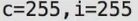
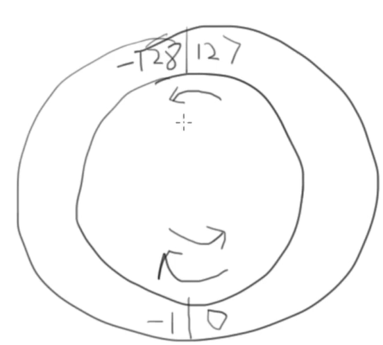
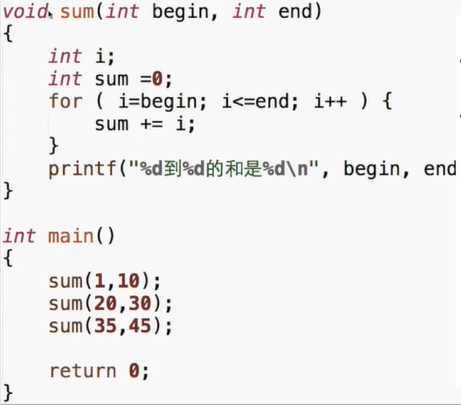
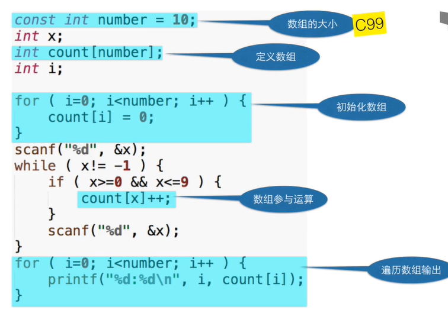

# c语言

### 1.初识c语言

##### 第一个程序

```c
#include <stdio.h>
int main()
{
	printf("Hello World!\n");
	return 0;
}
```

#####  程序框架

```c
#include <stdio.h>
int main()
{
	return 0;
}
```

1.所有的程序都需要这一段
2.直到学函数之前，我们的代码都只是在这个框架中间

##### 输出

```c
printf("Hello World!\n");
```

1."里面的内容叫做“字符串”，printf:会把其中的内容原封不动地输出
2.\n表示需要在输出的结果后面换一行

##### 程序中的错误

1. 编译的时候发现的错误所在的地方会以红色的底表示出来
2. 具体的错误原因列在下方的窗口里（是英文的)
3. C的编译器给出的错误提示往往不那么好“猜”

##### 做计算

```c
printf("%d\n",23+43);
```

%d说明后面有一个整数要输出在这个位置上

```c
printf("23+43=%d\n",23+43);
```

##### 四则运算


%表示取两个数相除以后的余数

### 2.变量

##### 变量了解

```c
int price = 0;
printf("请输入金额（元）：")；
scanf("%d",&price);
int change = 100 - price;
printf("找您%d元。\n",change);
```

1.int price 0;
2.这一行，定义了一个变量。变量的名字是price,类型是int,初始值是0。
3.变量是一个保存数据的地方，当我们需要在程序里保存数据时，比如上面的	例子中要记录用户输入的价格，就需要一个变量来保存它。用一个变量保存	了数据，它才能参加到后面的计算中，比如计算找零。

##### 定义变量

1.变量定义的一般形式就是：
    <类型名称><变量名称>；
●int price;
●int amount;
●int price,amount;

##### 变量的名字

1.变量需要一个名字，变量的名字是一种“标识符”，意思是它是用来识别这个和那个的不同的名字
2.标识符有标识符的构造规则。基本的原则是：标识符只能由字母、数字和下划线组成，数字不可以出现在第一个位置上，C语言的关键字（有的地方叫它们保留字）不可以用做标识符

##### c语言的保留字

```
auto,break,case,char,const,
continue,default,do,double,
else,enum,extern,float,for,
goto,if,int,long,register,return
short,signed,sizeof,static,
struct,switch,typedef,union,
unsigned,void,volatile,while,
inline,restrict
```

##### 赋值

1.int price  = 0;
2.这一行，定义了一个变量。变量的名字是price,类型是int,初始值是0。
3.price=0是一个式子，这里的“=”是一个赋值运算符，表示将“=”右边的值赋给左边的变量。

注意和数学不同，a=b在数学中表示关系，即a和b的值一样；而在程序设计中，a=b表示要求计算机做一个动作：将b的值赋给a。关系是静态的，而动作是动态的。在数学中，a=b和b=a是等价的，而在程序设计中，两者的意思完全相反

##### 初始化

1.当赋值发生在定义变量的时候，就像程序1中的第7行那样，就是变量的初始化。虽然C语言并没有强制要求所有的变量都在定义的地方做初始化，但是所有的变量在第一次被使用（出现在赋值运算符的右边）之前被应该赋值一次
2.如果没有初始化？

```c
#include <stdio.h>
int main()
{
int i;
int j;
j=i+10;
printf("%d\n",j)
return 0;
}
```

结果

如果没有初始化在内存中找到对应的是什么就是什么，相当于一个房间没收拾住进去了垃圾就都是你的了

##### 变量初始化

<类型名称><变量名称>=<初始值>；
●int price=0;
●int amount =100;
组合变量定义的时候，也可以在这个定义中单独给单个变量赋初值，如：
int price =0,amount =100;

##### 表达式

“=”是赋值运算符，有运算符的式子就叫做表达式。
price=0；
change=100-price；

一个表达式是一系列运算符和算子的组合，用来计算一个值

##### 运算符

运算符(operator)是指进行运算的动作，比如加法运算符“+”，减法运算符”。
算子(operand)是指参与运算的值，这个值可能是常数，也可能是变量，还可能
是一个方法的返回值

运算符优先级

赋值运算符

1. 赋值也是运算，也有结果
2. a=6的结果是a被赋予的值，也就是6
3. a=b=6——>a=(b=6)

嵌入式赋值

```c
int a=6;
int b;
int c = 1+(b=a);
```

1. 不利于阅读
2. 容易产生错误

不建议程序当中这样写代码

结合关系

1. 一般自左向右

2. 单目+-和赋值=自右向左

   ```c
   result = a = b =3 + c;
   result =2;
   result =(result = result * 2)* 6 *(result = 3 + result);
   ```

计算复利

在银行存定期的时候，可以选择到期后自动转存，并将到期的利息计入本金合并转存。如果1年期的定期利率是3.3%，那么连续自动转存3年后，最初存入的x元定期会得到多少本息余额？
本息合计=(x(1+3.3%))3


##### 变量类型

1.int price 0;
2.这一行，定义了一个变量。变量的名字是price,类型是int,初始值是0。
3.C是一种有类型的语言，所有的变量在使用之前必须定义或声明，所有的变量必须具有确定的数据类型。数据类型表示在变量中可以存放什么样的数据，变量中只能存放指定类型的数据，程序运行过程中也不能改变变量的类型。

int change 100-price;
定义了第二个变量change 并且做了计算这是c99版本写法

注意 ANSI C 只能在代码开头的地方定义变量

##### 读整数

```C
scanf("%d",&price);
```

1.要求scanf这个函数读入下一个整数，读到的结果赋值给变量price
2.小心price前面的&

##### 常量

```c
int change =100-price;
```

固定不变的数，是常数。直接写在程序里，我们称作直接量(literal)。
更好的方式，是定义一个常量：

```c
const int AMOUNT =100:
```

const,是一个修饰符，加在int的前面，用来给这个变量加上一个const(不变的)的属性。这个const的属性表示这个变量的值一旦初始化，就不能再修改了。

```c
int change = AMOUNT price;
```

如果你试图对常量做修改，把它放在赋值运算符的左边，就会被编译器发现，指出为一个错误

```c
#include <stdio.h>
int main(){
	int a;
	int b;
	printf("请输入两个整数");
	scanf("%d %d",&a,&b);
	printf("%d+%d=%d\n",a,b,a+b) ;
	return 0;
} 
```

##### 浮点数

计算身高

```c
#include <stdio.h>
int main(){
	printf("请输入身高的英尺和英寸，""如输入\"5 7\"表示5英尺7英寸:");
	int foot;
	int inch;
	scanf("%d %d",&foot,&inch);
	printf("身高是%f米。\n",((foot+inch/12)*0.3048));
	return 0;
}
```

1.因为两个整数的运算的结果只能是整数
	10/3*3=>?
2.10和10.0在C中是完全不同的数
3.10.0是浮点数

带小数点的数值。浮点这个词的本意就是指小数点是浮动的，是计算机内部表达非整数（包含分数和无理数）的一种方式。另一种方式叫做定点数，不过在C语言中你不会遇到定点数。人们借用浮点数这个词来表达所有的带小数点的数。


##### double

1.inch是定义为int类型的变量，如果把int换成double,我们就把它改为double类型的浮点数变量了。
2.double的意思是“双”，它本来是“双精度浮点数”的第一个单词，人们用来表示浮点数类型。除了double,还有float(意思就是浮点！)表示单精度浮点数。

●整数
	●int
	●printf("%d",.…）
	●scanf("%d",.…)
●带小数点的数
	●double
	●printf("%f",.…)
	●scanf("%lf",..）

##### 交换变量

```c
#include <stdio.h>
int main(){
	int a =5;
	int b=6;
	int t;
	t=a;
	a=b;
	b=t;
	printf("a=%d,b=%d\n",a,b);
	return 0;
} 
```

##### 程序调试

1.点击代码行数位置设置断点


点击调试


点击下一步


一直点击下一步

##### 复合赋值

1. ·5个算术运算符，+-*/%，可以和赋值运算符“=“ ”结合起来，形成复合赋值运算符:“+=”、“-=”、“*=”、“=”天和“%=”

2. ```c
   1. total +=5;
   2. total = total +5;
   ```

3. 注意两个运算符中间不要有空格

例

```c
1.total +=(sum+100)/2;
	total = total (sum+100)/2;
2.total*=sum+12;
	total=total*(sum+12);
3.total/=12+6;
	total =total / (12+6);
```

##### 递增递减运算符

“++”和“”是两个很特殊的运算符，它们是单目运算符，这个算子还必须是变量。
这两个运算符分别叫做递增和递减运算符，他们的作用就是给这个变量+I或者-1。

```c
count++;
count +=1；
count = count +1；
```

前缀后缀

1. ++和--可以放在变量的前面，叫做前缀形式，也可以放在变量的后面，叫做后缀形式。
2. a++的值是a加1以前的值，而++a的值是加了1以后的值，无论哪个，a自己的值都加了1了。

```c
#include <stdio.h>
int main()
{
int a;
a=10;
printf("a++=%d\n",a++);
printf("a=%d小n",a);
printf("++a=%d\n",++a)
printf("a=%d\n",a);
return 0;
}
```


尽量不要组合进表达式

1. 这两个运算符有其历史来源

2. 可以单独使用，但是不要组合进表达式

   ```
   1. ++i++__>?
   2. i++++——>?
   ```

3. a=b+=c++-d+--e/-f 

### 3.判断

##### if条件判断

写法

```
if(条件成立){
	...
}
```

一个基本的if语句由一个关键字if开头，跟上在括号里的一个表示条件的逻辑表达
式，然后是一对大括号“0”之间的若干条语句。如果表示条件的逻辑表达式的结
果不是零，那么就执行后面跟着的这对大括号中的语句，否则就跳过这些语句
不执行，而继续下面的其他语句。

注意

语句这一行结束的时候并没有表示语句结束的；”，而后面的赋值语句写在f的下一行，并且缩进了，在这一行结束的时候有一个表示语句结束的“，”。这表明这条赋值语句是if语句的一部分，if语句拥有和控制这条赋值语句，决定它是否要被执行。

```c
#include <stdio.h>
int main(){
	int hour1,minute1;
	int hour2,minute2;
	scanf ("%d %d",&hour1,&minute1);
	scanf("%d %d",&hour2,&minute2);
	int ih = hour2-hour1;
	int im = minute2 - minute1;
	if (im <0 ){
		im = 60 +im;
		ih--;
	}
	printf("时间差是%d小时%d分。\n",ih,im);
}
```

条件

计算两个值之间的关系，所以叫做关系运算


1. 当两个值的关系符合关系运算符的预期时，关系运算的结果为整数1，否则为整数0

2. ```
   1. printf("%d\n",5==3);
   2. printf("%d\n",5>3);
   3. printf("%d\n",5<=3);
   ```

优先级

1. 所有的关系运算符的优先级比算术运算的低，但是比赋值运算的高

   ```c
   1. 7>=3+4
   2. int r=a>0;
   ```

2. 判断是否相等的==和！=的优先级比其他的低，而连续的关系运算是从左到右进行的

   ```
   5>3==6>4
   6>5>4
   a==b==6
   a==b>0
   ```

##### 练习

找零计算器

1.找零计算器需要用户做两个操作：输入购买的金额，输入支付的票面，而找零计算器则根据用户的输入做出相应的动作：计算并打印找零，或告知用户余额不足以购买。
2.从计算机程序的角度看，这就是意味着程序需要读用户的两个输入，然后进行一些计算和判断，最后输出结果

```c
#include <stdio.h>
int main(){
	int price=0;
	int bill=0;
	printf("请输入金额：");
	scanf("%d",&price);
	printf("请输入票面：");
	scanf("%d",&bill);
	if(bill>=price){
		printf("应该找您：%d\n",bill-price);
	}else{
		printf("应该补齐：%d\n",price-bill);
	}
} 
```

输入年龄

```c
const int MINOR = 35;
int age = 0;
printf("请输入你的年龄：");
scanf("%d",&age);
printf("你的年龄是%d岁。\n",age);
if (age < MINOR ){
    printf("年轻是美好的，");
}
printf("年龄决定了你的精神世界，好好珍惜吧。\n");
```

判断3个数那个最大

```c
int a,b,C;
scanf("%d %d %d",&a,&b,&c);
int max = 0;
if ( a>b ){
    if( a>c ){
        max = a;
    }else{
        max = c;
    }
}else{
     if( b>c ){
        max = b;
    }else{
        max = c;
    }
}
}
printf("The max is %d\n",max);
```

##### 嵌套

当if的条件满足或者不满足的时候要执行的语句也可以是一条if或if-else语句，这就是嵌套的if语句

else的匹配

else总是和最近的那个if匹配

建议

1. 在if或else后面总是用{}
2. 即使只有一条语句的时候

##### 分段函数

f(x)=-l;x<0
		0;x=0
		2X;X>0

```c
if (x <0){
   f=-1 
}else if (x ==0){
   f=0; 
}else{
   f=2*X;
}
```

##### 常见错误

1. 忘了大括号 永远在if和else后面加上大括号，即使当时后面只有一条语
2. if后面的分号 
3. 错误使用==和= if只要求0里的值是零或非零

##### 代码风格

1. 在if和else之后必须加上大括号形成语句块；
2. 大括号内的语句缩进一个tab的位置；

##### switch-case

```c
switch(控制表达式){
case 常量：
	语句
case 常量：
	语句	
default:
	语句
}
```

1. 控制表达式只能是整数型的结果
2. 常量可以是常数，也可以是常数计算的表达式

break

switch语句可以看作是一种基于计算的跳转，计算控制表达式的值后，程序会
跳转到相匹配的case（分支标号)处。分支标号只是说明switch内部位置的路
标，在执行完分支中的最后一条语句后，如果后面没有break,就会顺序执行到下
面的case里去，直到遇到一个break,或者switch结束为止。

### 4.循环

##### while

```c
while(<循环条件>){
    循环体
};
```

1. 如果我们把while翻译作“当”，那么一个while循环的意思就是：当条件满足时，不断地重复循环体内的语句。
2. 循环执行之前判断是否继续循环，所以有可能循环一次也没有被执行；
3. 条件成立是循环继续的条件。

```c
int x;
int n =0;
scanf("%d",&x);
n++;
×/=10;
while (x > 0){
    n++;
	x/=10;
}
printf("%d\n",n)
```

##### do-while

在进入循环的时候不做检查，而是在执行完一轮循环体的代码之后，再来检查循环的条件是否满足，如果满足则继续下一轮循环，不满足则结束循环

```c
do
{
<循环体语句>
}while(<循环条件>);
```

```c
int x;
scanf("%d",&x);
int n =0;
do
{
	x/=10;
	n++;
}while (x >0);
printf("‰d",n);
```

区别

do-while循环和while循环很像，区别是在循环体执行结束的时候才来判断条件。也就是说，无论如何，循环都会执行至少1遍，然后再来判断条件。与while循环相同的是，条件满足时执行循环，条件不满足时结束循环。

##### 练习

猜数游戏

1. 让计算机来想一个数，然后让用户来猜用户每输入一个数，就告诉它是大了还是小了，直到用户猜中为止，最后还要告诉用户它猜了多少次。
2. 因为需要不断重复让用户猜，所以需要用到循环
3. 在实际写出程序之前，我们可以先用文字描述程序的思路
4. 核心重点是循环的条件
5. 人们往往会考虑循环终止的条件

设计

1. 计算机随机想一个数，记在变量number里
2. 一个负责计次数的变量count初始化为0；
3. 让用户输入一个数字a;
4. count递增（加一)；
5. 判断a和number的大小关系，如果a大，就输出“大”；如果a小就输出“小”；
6. 如果a和number.是不相等的（无论大还是小)，程序转回到第3步；
7. 否则，程序输出“猜中”和次数，然后结束。

随机数

每次召唤rand()就得到一个随机的整数

%100

x%n的结果是[0，n-l]的一个整数

使用1-100

```c
	srand(time(0));
	int number=rand()%100+1;
```

程序代码

```c
#include <stdio.h>
#include <stdlib.h>
#include <time.h>
int main(){
	srand(time(0));
	int number=rand()%100+1;
	int count =0;
	int a=0;
	printf("我已经想好了一个1到100之间的数。\n");
	do{
		printf("请猜1-100之间的数字");
		scanf("%d",&a);
		count++;
		if(a>number){
			printf("你猜大了");
		}else if(a<number){
			printf("你猜小了");
		} 
	}while(a!=number);
	printf("太好了，使用了%d次就猜到了答案\n",count);
	return 0;
} 
```

算平均数

让用户输入一系列的正整数，最后输入-1表示输入结束，然后程序计算出这些数字的平均数，输出输入的数字的个数和平均数
变量->算法->流程图->程序

设计

1. 一个记录读到的整数的变量
2. 平均数要怎么算？只需要每读到一个数，就把它加到一个累加的变量里，到全部数据读完，再拿它去除读到的数的个数就可以了
3. 一个变量记录累加的结果，一个变量记录读到的数的个数

算法

1. 初始化变量sum和count为0；
2. 读入number;
3. 如果number不是-l,则将number加入sum,并将count加I,回到2;
4. 如果number是-l,则计算和打印出sum/count(注意换成浮点来计算)。

程序

```c
#include <stdio.h>
int main()
{
int number;
int sum =0;
int count =0;
scanf ("%d",&number);
while (number !=-1 ){
	sum +=number;
	count ++;
	scanf("%d",&number);
};
printf("%f\n",1.0*sum/count);
return 0;
}
```

整数的分解

设计

1. 一个整数是由至多位数字组成的，如何分解出整数的各个位上的数字，然后加以计算
2. 对一个整数做%10的操作，就得到它的个位数；
3. 对一个整数做/10的操作，就去掉了它的个位数；
4. 然后再对2的结果做%10，就得到原来数的十位数了
5. 依此类推。
6. 输入一个正整数，输出逆序的数 结尾的0的处理

代码

```c
#include <stdio.h>
int main()
{
int x;
scanf("%d",&x);
//×=12345;
int digit;
int ret =0;
while (x>0 ){
	digit =x%10;
	//printf("%d\n",digit);
	ret = ret*10 + digit;
	printf("x=%d,digit=%d,ret=%d\n",x,digit,ret);
	x/=10;
}
printf("%d",ret);
return 0;
}
```

##### for

```
for（初始动作；条件；每轮的动作){}
```

for中的每一个表达式都是可以省略的

```
for(;条件；)==while(条件)
```

for循环像一个计数循环：设定一个计数器，初始化它，然后在计数器到达某值之前，重复执行循环体，而每执行一轮循环，计数器值以一定步进进行调整，比如加1或者减1

```c
for（i=0;i<5;i=i+1){
printf("%d",i);
}
```

可以理解为

```c
for(count=-l0;count>0;count-）
```

就读成：“对于一开始的count=-I0,当count>0时，重复做循环体，每一轮循环
在做完循环体内语句后，使得count-。

循环次数

```
for（i=0;i<n;i++)
```

则循环的次数是n,而循环结束以后，的值是n。循环的控制变量i,是选择从0开始
还是从1开始，是判断i<n还是判断i<=n,对循环的次数，循环结束后变量的值都有
影响

##### break-continue

break:跳出循环
continue:跳过循环这一轮剩下的语句进入下一轮

注意：只能对它所在的那层循环做

可以使用goto跳出多重循环


##### 选择

1. 如果有固定次数，用for
2. 如果必须执行一次，用do while
3. 其他情况用while

##### 练习

I00以内的素数

```c
#include <stdio.h>
int main()
{
int x;
f0r(x=1;x<=100;X++){
int i;
int isPrime 1;
for(i=2;i<x;i++){
if(×%i=0)(
isPrime 0;
break;
}
}
if isPrime ==1 )
printf("%d "x);
}
}
return 0;
}
```

正序分解整数

设计

1. 输入一个非负整数，正序输出它的每一位数字
2. 输入：13425
3. 输出：13425

代码

```c
#include <stdio.h>
int main(){
	int x;
	scanf("%d",&x);
	do{
		int d =x%10;
		printf("%d",d);
		if(x>=10){
			printf(" ");
		}
		x/=10;
	}while(x>0);
	return 0;
} 
```

倒序分解整数

代码

```c
#include <stdio.h>
int main(){
	int x;
	scanf("%d",&x);
	int t =0;
	do{
		int d =x%10;
		t=t*10+d;
		x/=10;
	}while(x>0); 
	printf("t=%d\n",t);
	x=t;
	do{
		int d =x%10;
		printf("%d",d);
		if(x>=10){
			printf(" ");
		}
		x/=10;
	}while(x>0);
	return 0;
} 
```

其他方法

```c
#include <stdio.h>
int main(){
	int x;
	scanf("%d",&x);
	int mask=1;
	int t=x;
	while(t>9){
		t/=10;
		mask*=10; 
	}
	printf("x=%d,mask=%d\n",x,mask);
	do{
//		printf("mask=%d",mask); 
		int d=x/mask;
		printf("%d",d);
		if(mask>9){
			printf(" ");
		}
		x %= mask;
		mask/=10;
	}while(mask>0);
	printf("\n");
	return 0;
} 
```

最大公约数

方法
辗转相除法

1. 如果b等于0，计算结束，a就是最大公约数；
2. 否则，计算a除以b的余数，让a等于b,而b等于那个余数；
3. 回到第一步。


代码

```c
#include <stdio.h>
int main(){
	int a,b;
	int t;
	scanf("%d %d",&a,&b);
	while(b!=0){
		t=a%b;
		a=b;
		b=t;
		printf("a=%d,b=%d,t=%d\n",a,b,t);
	}
	printf("gcd=%d\n",a);
	return 0;
} 
```

水仙花数

水仙花数是指一个N位正整数(N>=3),它的每个位上的数字的N次幂之和等于它本身。例如：153=13+53+33。本题要求编写程序计算所有N位水仙花数。
**输入格式：**
输入在一行中给出一个正整数N(3<=N<=7)。
**输出格式：**
按递增顺序输出所有N位水仙花数，每个数字占一行。
**输入样例：**
3
**输出样例：**                                                                                                                153
378
371 																														407

代码

```c
#include <stdio.h>
int main(){
	int n;
	scanf("%d",&n);
	int first=1;
	int i=1;
	while(i<n){
		first*=10;
		i++;
	}
	i=first;
	while(i<first*10){
		int t=i;
		int sum=0;
		do{
			int d=t%10;
			t/=10;
			int p=d;
			int j=1;
			while(j<n){
				p*=d;
				j++; 
			} 
			sum+=p;
		}while(t>0);
		if(sum==i){
			printf("%d\n",i);
		}
		i++;
	}
	return 0;
} 
```

### 5.数据类型

##### 数据类型

C语言的变量，必须：在使用前定义，并且确定类型

C以后的语言向两个方向发展：

1. ·C++/Java更强调类型，对类型的检查更严格
2. ·JavaScript、Python、PHP不看重类型，甚至不需要事先定义

**类型安全**

1. 支持强类型的观点认为明确的类型有助于尽早发现程序中的简单错误
2. 反对强类型的观点认为过于强调类型迫使程序员面对底层、实现而非事务辑
3. 总的来说，早期语言强调类型，面向底层的语言强调类型，C语言需要类型，但是对类型的安全检查并不足够

**c语言的数据类型**

1. 整数 char、short、int、long、**long long**
2. 浮点数 float、double、**long double**
3. 逻辑	**bool**
4. 指针
5. 自定义类型

注意加粗的是C99的

**类型有何不同**

1. 类型名称：int、long、double
2. 输入输出时的格式化：%d、%ld、%lf
3. 所表达的数的范围：char < short < int < float< double
4. 内存中所占据的大小：1个字节到16个字节
5. 内存中的表达形式：二进制数（补码）、编码

**sizeof**

是一个运算符，给出某个类型或变量在内存中所占据的字节数

```
sizeof(int)
sizeof(i)
```

1. sizeof是静态运算符，它的结果在编译时刻就决定了
2. 不要在sizeof的括号里做运算，这些运算不会做的

##### **整数**

1. char:1字节(8比特) -128~127
2. short:2字节 -32768 ~ 32767
3. int:取决于编译器(CPU),通常的意义是“1个字”
4. long:取决于编译器(CPU),通常的意义是“1个字
5. long long:8字节

整数的内部表达

计算机内部一切都是二进制
	18->00010010
	0->00000000
	-18—>?

十进制用“-”来表示负数，在做计算的时候

二进制负数

1. 1个字节可以表达的数：00000000-11111111(0-255)

2. 三种方案：

   1.仿照十进制，有一个特殊的标志表示负数

   2.取中间的数为0，如1000000表示0，比它小的是负数，比它大的是正数

   3.补码

3. 实际上计算机采用的是补码：

   考虑-1，我们希望-1+1一>0。如何能做到？
   ·0->00000000
   ·1->00000001
   ·11111111+00000001->100000000

   ·因为0-1一>-1，所以，-1=
   ·(1)00000000-00000001->11111111
   ·11111111被当作纯二进制看待时，是255，被当作补码看待时是-1
   ·同理，对于-a,其补码就是0-a,实际是((2)n)-a,n是这种类型的位数

   **·补码的意义就是拿补码和原码可以加出一个溢出的“零"**

   

数的范围

1. 对于一个字节(8位)，可以表达的是：

   00000000-11111111

2. ·其中

   00000000->0

   11111111~10000000-> -1 ~ -128

   00000001~01111111-> 1 ~ 127

```c
#include <stdio.h>
int main(){
	char c=255;
	int i=255;
	printf("c=%d,i=%d\n",c,i) ;
	return 0;
}
```


**unsigned**

如果一个字面量常数想要表达自己是unsigned,可以在后面加u或U
	255U
用l或L表示long(long)
*unsigned的初衷并非扩展数能表达的范围，而是为了做纯二进制运算，主要是为了移位

```c
#include <stdio.h>
int main(){
	unsigned char c=255;
	int i=255;
	printf("c=%d,i=%d\n",c,i) ;
	return 0;
}
```



整数越界

·整数是以纯二进制方式进行计算的，所以：
	·11111111+1->100000000->0
	·01111111+1->10000000->-128
	·10000000-1->01111111->127



```c
#include <stdio.h>
int main(){
	 char c=127;
	int i=255;
	c=c+1;
	printf("c=%d,i=%d\n",c,i) ;
	return 0;
}
```


```c
#include <stdio.h>
int main(){
	 char c=-128;
	int i=255;
	c=c-1;
	printf("c=%d,i=%d\n",c,i) ;
	return 0;
}
```


##### 整数的格式化

整数的输入输出

1. 只有两种形式：int或long long
2. %d:int
3. %u:unsigned
4. %ld:longlong
5. %lu:unsigned long long

8进制和16进制

1. 一个以0开始的数字字面量是8进制
2. 一个以0x开始的数字字面量是16进制
3. ·%0用于8进制，%X用于16进制

注意8进制和16进制只是如何把数字表达为字符串，与内部如何表达数字无关

·16进制很适合表达二进制数据，因为4位二进制正好是一个16进制位
·8进制的一位数字正好表达3位二进制
·因为早期计算机的字长是12的倍数，而非8

选择整数类型

1. ·为什么整数要有那么多种？

   为了准确表达内存，做底层程序的需要

2. 没有特殊需要，就选择int

   现在的CPU的字长普遍是32位或64位，一次内存读写就是一个int,一次计算也是一个int,选择更短的类型不会更快，甚至可能更慢

   *现代的编译器一般会设计内存对齐，所以更短的类型实

   际在内存中有可能也占据一个int的大小（虽然sizeof告诉你更小)

3. unsigned与否只是输出的不同，内部计算是一样的

##### 浮点


 

科学计数法


输出精度

在%和f之间加上.n可以指定输出小数点后几位，这样的输出是做4舍5入的

```c
printf("%.3f\n",-0.0049);
printf("%.30f\n",-0.0049);
printf("%.3f\n",-0.00049);
```

超过范围的浮点数

1. printf输出inf表示超过范围的浮点数：±∞
2. printf输出nan表示不存在的浮点数

带小数点的字面量是double而非float
float需要用f或F后缀来表明身份

浮点数的内部表达

浮点数在计算时是由专用的硬件部件实现的
计算double和float所用的部件是一样的


选择浮点类型

·如果没有特殊需要，只使用double
·现代CPU能直接对double做硬件运算，性能不会比float差，在64位的机器上，数据存储的速度也不比float慢

##### 字符类型

char是一种整数，也是一种特殊的类型：字符。这是
因为：用单引号表示的字符字面量：'a','1'
			''也是一个字符
			printf和scanf里用%c来输入输出字符

字符的输入输出

```c
#include <stdio.h>
int main()
{
char c;
char d;
c=1;
d='1';
if (c==d ){
    printf("相等\n");
}
else{
    printf("不相等\n");
}
printf("c=%d\n",c);
printf("d=%d\n",d);
return 0;
```


如何输入'1'这个字符给char c?

```c
·scanf("%c",&c);//输出1
·scanf("%d",&i);c=i;//输出49
```

'1'的ASCll编码是49，所以当c==49时，它代表'1'

```c
printf("%i%c\n",c,c )
```


混合输入

有何不同？

```c
scanf("%d %c",&i,&c);
scanf("%d%c",&i,&c);
```

有空格输入不会要两个数之间的空格，没有空格读到整数结束会把空格读进去

字符计算

1. 一个字符加一个数字得到ASCll码表中那个数之后的字符
2. 两个字符的减，得到它们在表中的距离

大小写转换

1. 字母在ASCll表中是顺序排列的

2. 大写字母和小写字母是分开排列的，并不在一起

3. ‘a'-‘A可以得到两段之间的距离，于是

   a+'a'-‘A”可以把一个大写字母变成小写字母

   a+'A'-a'可以把一个小写字母变成大写字母

##### 逃逸字符

用来表达无法印出来的控制字符或特殊字符，它由一个反斜杠"\"开头，后面跟上
一个字符，这两个字符合起来，组成了一个字符


##### 类型转换

**自动类型转换**

当运算符的两边出现不一致的类型时，会自动转换成较大的类型
	大的意思是能表达的数的范围更大
	char -short->int->long->long long
	int->float->double

对于printf,任何小于int的类型会被转换成int;float会被转换成double
但是scanf不会，要输入short,需要%hd

**强制类型转换**


要把一个量强制转换成另一个类型（通常是较小的类型)，需要：
	(类型)值
	比如：
		(int)10.2
		(short)32
注意这时候的安全性，小的变量不总能表达大的量
	(short)32768

强制类型转换只是从那个变量计算出了一个新的类型的值，它并不改变那个变量，无论是值还是类型都不改变

注意强制类型转换的优先级高于四则运算

##### bool

#include <stdbool.h>
之后就可以使用bool和true、false

##### 逻辑运算

逻辑运算是对逻辑量进行的运算，结果只有0或1
逻辑量是关系运算或逻辑运算的结果


例

如何判断一个字符c是否是大写字母？
C>=‘A'&&c<=’Z‘

优先级


短路

逻辑运算是自左向右进行的，如果左边的结果已经能够决定结果了，就不会做右边的计算

```
a==6&&b==1
a==6&&b+=1
```

对于&&，左边是false时就不做右边了
对于‖，左边是true时就不做右边了


注意不要把赋值，包括复合赋值组合进表达式！

##### 条件运算符

```c
count =(count > 20)?count -10 count+10;
```

条件、条件满足时的值和条件不满足时的值

相当于

优先级

条件运算符的优先级高于赋值运算符，但是低于其他运算符

##### 逗号运算

逗号用来连接两个表达式，并以其右边的表达式的值作为它的结果。逗号的优先级是所有的运算符中最低的，所以它两边的表达式会先计算；逗号的组合关系是自左向右，所以左边的表达式会先计算，而右边的表达式的值就留下来作为逗号运算的结果。

主要在for中使用

### 6.函数

##### 什么是函数？

函数是一块代码，接收零个或多个参数，做一件事情，并返回零个或一个值


##### 调用函数

1. 函数名（参数值）；
2. （）起到了表示函数调用的重要作用
3. 即使没有参数也需要0
4. 如果有参数，则需要给出正确的数量和顺序
5. 这些值会被按照顺序依次用来初始化函数中的参数

##### 函数返回

函数知道每次是哪里调用它会返回到正确的地方

**从函数返回值**

return停止函数的执行，并送回一个值
	return;
	return 表达式；

可以赋值给变量
可以再传递给函数
甚至可以丢弃


没有返回值的函数

void函数名（参数表）
不能使用带值的return
	可以没有return
调用的时候不能做返回值的赋值

##### 函数先后关系



1. 像这样把sum()写在上面，是因为：
2. C的编译器自上而下顺序分析你的代码
3. 在看到sum(1,10)的时候，它需要知道sum()的样子
4. 也就是sum()要几个参数，每个参数的类型如何，返回什么类型
5. 这样它才能检查你对sum()的调用是否正确

##### 函数原型

1. 函数头，以分号“：”结尾，就构成了函数的原型

2. 函数原型的目的是告诉编译器这个函数长什么样

   名称

   参数（数量及类型）

   返回类型

3. 旧标准习惯把函数原型写在调用它的函数里面

4. 现在一般写在调用它的函数前面

5. 原型里可以不写参数的名字，但是一般仍然写上


##### 参数传递

类型不匹配？

1. 调用函数时给的值与参数的类型不匹配是C语言传统上最大的漏洞
2. 编译器总是悄悄替你把类型转换好，但是这很可能不是你所期望的
3. 后续的语言，C++Java在这方面很严格

传值

1. 每个函数有自己的变量空间，参数也位于这个独立的空间中，和其他函数没有关系

2. 过去，对于函数参数表中的参数，叫做“形式参数”，调用函数时给的值，叫做“实际参数”

3. 由于容易让初学者误会实际参数就是实际在函数中进行计算的参数，误会调用函数的时候把变量而不是值传进去了，所以我们不建议继续用这种古老的方式来称呼它们

   我们认为，它们是参数和值的关系

##### 本地变量

1. 函数的每次运行，就产生了一个独立的变量空间，在这个空间中的变量，是函数的这次运行所独有的，称作本地变量
2. 定义在函数内部的变量就是本地变量
3. 参数也是本地变量

变量的生存期和作用域

1. 生存期：什么时候这个变量开始出现了，到什么时候它消亡了
2. 作用域：在（代码的）什么范围内可以访问这个变量(这个变量可以起作用)
3. 对于本地变量，这两个问题的答案是统一的：大括号内------块

本地变量的规则

1. 本地变量是定义在块内的
2. 它可以是定义在函数的块内
3. 也可以定义在语句的块内
4. 甚至可以随便拉一对大括号来定义变量
5. 程序运行进入这个块之前，其中的变量不存在，离开这个块，其中的变量就消失了
6. 块外面定义的变量在里面仍然有效
7. 块里面定义了和外面同名的变量则掩盖了外面的
8. 不能在一个块内定义同名的变量
9. 本地变量不会被默认初始化
10. 参数在进入函数的时候被初始化了

##### 其它

**没有参数时**

1. void f(void);

   还是

2. void f();

3. 在传统C中，它表示函数的参数表未知，并不表示没有参数

**逗号运算符？**

调用函数时的逗号和逗号运算符怎么区分？
调用函数时的圆括号里的逗号是标点符号，不是运算符
f(a,b)
f((a,b))

**函数里的函数？**

C语言不允许函数嵌套定义

**关于main**

1. int main()也是一个函数

2. 要不要写成int main(void)?

3. return的0有人看吗？

   Windows : if error level 1...

   Unix Bash : echo$?

   Csh : echo$status

### 7.数组

##### 定义数组

1. ·<类型>变量名称[元素数量];

   ```c
   int grades[100];
   double weight[20];
   ```

2. 元素数量必须是整数

3. C99之前：元素数量必须是编译时刻确定的字面量

##### **数组的集成初始化**

集成初始化时的定位

1. 用[n]在初始化数据中给出定位
2. 没有定位的数据接在前面的位置后面
3. 其他位置的值补零
4. 也可以不给出数组大小，让编译器算
5. 特别适合初始数据稀疏的数组

##### 数组的赋值


1. 数组变量本身不能被赋值
2. 要把一个数组的所有元素交给另一个数组，必须采用遍历

##### 遍历数组

1. 通常都是使用for循环，让循环变量i从0到<数组的长度，这样循环体内最大的正好是数组最大的有效下标

2. 常见错误是：

   循环结束条件是<=数组长度，或；

   离开循环后，继续用i的值来做数组元素的下标！

##### 数组是什么

1. 是一种容器（放东西的东西)，特点是：

   其中所有的元素具有相同的数据类型；

   一旦创建，不能改变大小

   *（数组中的元素在内存中是连续依次排列的)

2. int a[10]

   一个int的数组
   10个单元：a[0],a[1],.…,a[9]
   每个单元就是一个int类型的变量
   可以出现在赋值的左边或右边：
   	a[2]=a[1]+6;
   *在赋值左边的叫做左值

3. 数组的单元

   数组的每个单元就是数组类型的一个变量
   使用数组时放在[]中的数字叫做下标或索引，下标从0开始计数：
   	grades[O]
   	grades[99]
   	average[5]

有效的下标范围

1. 编译器和运行环境都不会检查数组下标是否越界，无论是对数组单元做读还是写

2. 一旦程序运行，越界的数组访问可能造成问题，导致程序崩溃

3. segmentation fault

4. 但是也可能运气好，没造成严重的后果

5. 所以这是程序员的责任来保证程序只使用有效的下标值：[0，数组的大小-1]

6. 长度为0的数组？

   int a[0];
   可以存在，但是无用

##### 二维数组

```
inta[3][5];
```

通常理解为a是一个3行5列的矩阵

##### 二维数组的遍历


a[i] [j]是一个int表示第行i第j列上的单元 		                                                                                                     a[i,j]是什么？= a[j]  ,是运算符运算之后是j

##### 二维数组的初始化


1. 列数是必须给出的，行数可以由编译器来数
2. 每行一个{}，逗号分隔
3. 最后的逗号可以存在，有古老的传统
4. 如果省略，表示补零
5. 也可以用定位（*C99ONLY)

##### 练习

```c
#include <stdio.h>
int main(){
	int x;
	double sum =0;
	int cnt =0;
	int number[100];
	scanf ("%d",&x);
	while(x!= -1){
		number[cnt]=x;
		sum +=x;
		cnt ++;
		scanf("%d",&x);
	}
	if(cnt >0){
		printf("%f\n",sum/cnt);	
		int i;
		for (i=0;i<cnt;i++){
			if (number[i]>sum/cnt )
			printf("%d\n",number [i]);
		}
	}
	return 0;
} 
```


这个程序是危险的，因为输入的数据可能超过100个

如果先让用户输入有多少数字要计算，可以用C99的新功能来实现

写一个程序，输入数量不确定的[0,9]范围内的整数，统计每一种数字出现的次数，
输入-|表示结束

```c
#include <stdio.h>
int main(){
	const int number=10;
	int x;
	int i;
	int count[10];
	for(i=0;i<number;i++){
		count[i]=0;
	}
	scanf("%d",&x);
	while(x!=-1){
		if(x>=0 && x<=9){
			count[x]++;
		}
		scanf("%d",&x);
	}

	for (i=0;i<number;i++){
		printf("%d:%d\n",i,count[i]);
	}
	return 0;
}
```




**数组的大小**

1. sizeof给出整个数组所占据的内容的大小，单位是字节

   ```c
   sizeof(a)/sizeof(a[0])
   ```

2. sizeof(a[0])给出数组中单个元素的大小，于是相除就得到了数组的单元个数

3. 这样的代码，一旦修改数组中初始的数据，不需要修改遍历的代码

**在一组给定的数据中，如何找出某个数据是否存在？**

注意

1. 数组作为函数的参数时：

   不能在[]中给出数组的大小

   不能再利用sizeof来计算数组的元素个数！

代码

```c
#include <stdio.h>
int main(void){
	int a[]={4,6,8,7,1,3,5,9,11,13,23,32};
	int x;
	int loc;
	printf("请输入一个数字");
	scanf("%d",&x);
	loc=search(x,a,sizeof(a)/sizeof(a[0]));
	if(loc!=-1){
		printf("%d在第%d个位置上\n",x,loc);
	}else{
		printf("%d不存在\n",x);	
	}
	return 0;
}
int  search(int key,int a[],int length){
	int ret=-1;
	int i;
	for(i=0;i<length;i++){
		if(a[i]==key){
			ret=i;
			break;
		}
	}
	return ret;
}
```


构造素数表

欲构造n以内（不含）的素数表

1. 开辟prime[n],初始化其所有元素为1，prime[x]为1表示X是素数
2. 令X=2
3. 如果x是素数，则对于(i=2;x\*i<n;i++)令prime[i*x]=0
4. 令x++，如果x<n,重复3，否则结束

代码

```c
#include <stdio.h>
int main(void){
	const int maxnumber=10000;
	int isprime[maxnumber];
	int i;
	int x;
	for(i=0;i<maxnumber;i++){
		isprime[i]=1; 
	}
	for(x=2;x<maxnumber;x++){
		if(isprime[x]){
			for(i=2;i*x<maxnumber;i++){
				isprime[i*x]=0;
			}
		}
	}
	for(i=2;i<maxnumber;i++){
		if(isprime[i]){
			printf("%d\t",i);
		}
	}
	printf("\n");
	
	return 0;
}
```

算法不一定和人的思考方式相同


tic-tac-toe游戏

读入一个3X3的矩阵，矩阵中的数字为1表示该位置上有一个X,为0表示为o
程序判断这个矩阵中是否有获胜的一方，输出表示获胜一方的字符X或O,或输出无人获胜                                         


