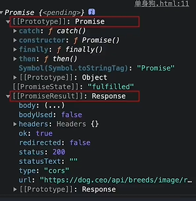
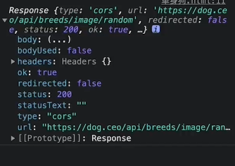

# fetch

```js
let wtf=fetch('https://dog.ceo/api/breeds/image/random');
console.log(wtf)
```



```js
fetch('https://dog.ceo/api/breeds/image/random')
then(response =console.log(response ))
```



```js
fetch('https://dog.ceo/api/breeds/image/random')
then(response =console.log(response.json()));
```

```js
fetch('https://dog.ceo/api/breeds/image/random')
.then(response =response.json())
then(data =console.Log(data))
```

